## HTTP 协议

HTTP (hyper text transfer protocol) 协议也称超文本传输协议，
简单地说，它是客户端与浏览器交流的一种规范。

HTTP 是基于 TCP 之上的一种**无状态**的传输协议。

### 何为基于 TCP？

HTTP 只是规定了客户端与服务器之间交流的方式，本身无法传输
数据。HTTP 的数据传输需要依靠 TCP 提供的接口而实现，
也就是说，HTTP 是基于 TCP 而实现的。
TCP 负责传输数据，而 HTTP 协议则是规定的数据的格式。例如：
HTTP 规定的请求行、请求头和请求体的格式。

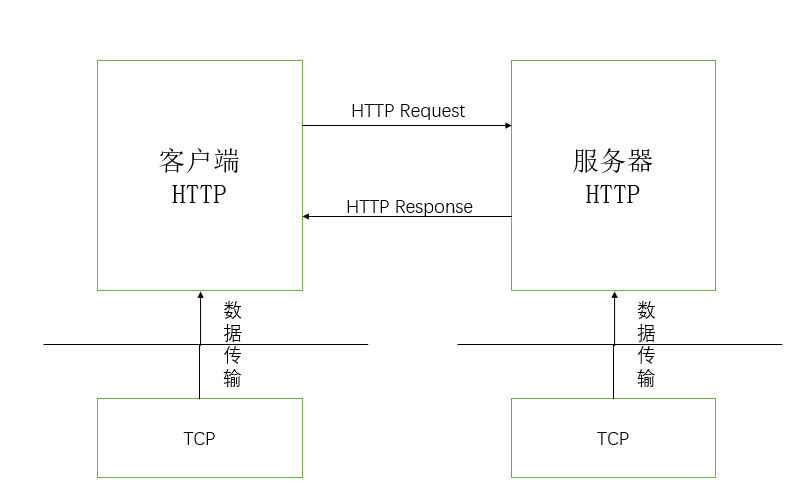

HTTP 最典型的应用模型就是客户端与服务器模型。通常情况下，
客户端可以是我们的浏览器或者其他 web 应用。

当我们在浏览器中输入 URL 时，浏览器会向服务器发送一个 TCP 连接。
服务器接受客户端的 TCP 连接后，客户端与服务器就可以进行通信。
为了使客户端与服务器能够正常交流，HTTP 规定了双方的数据格式。

HTTP 报文分为两种类型：请求报文和响应报文。采用 ASCII 进行编码。

#### 请求报文

HTTP 请求报文包含三个部分：请求行、请求头和请求体。

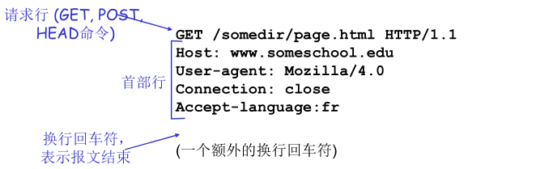

<center>（图片来源：计算机网络 - 中科大 郑老师）</center>

其中，请求行（request line）包含**请求方法（method）**、
**请求的路径（url）**和** HTTP 版本号**。
请求头（request header）包含了一些请求相关的字段。
请求体（request body）包含要请求的内容。

可以将 http 请求报文抽象成如下的格式：

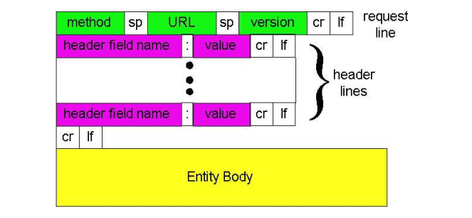

<center>（图片来源：计算机网络 - 中科大 郑老师）</center>

##### URL

URL（Uniform Resource Locator）用于标识请求资源的主机地址。
URL 分为分为以下几个部分：

- 协议（protocol）
- 域名（domain name）
- 端口（port）
- 路径（path）
- 其他。例如：参数（parameters），瞄点（anchor）等。

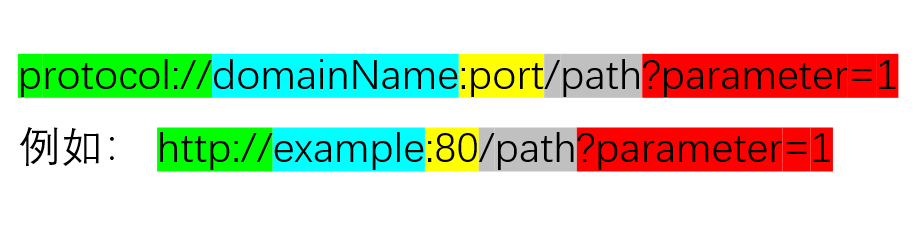

默认情况下，http 默认端口为 80，https 的默认端口为 441。

##### Method

请求方法表明了 http 请求资源的方式。主要的方法有：

- GET。请求资源。
- HEAD。与 GET 方法相同，但是 HEAD **没有**请求主体（request body）。
- POST，发送表单数据。
- PUT。文件上传。
- DELETE。删除指定资源。
- OPTIONS。预检。
- PATCH。
- 其他。

#### 响应报文

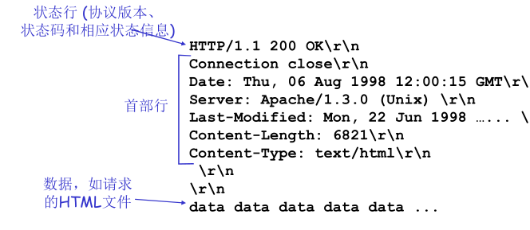

<center>（图片来源：计算机网络 - 中科大 郑老师）</center>

其中，响应状态行（response line）包含协议版本、响应 状态码和状态码信息。
常见的响应状态有:

- 200：OK。
- 301：Moved Permanently。
- 400：Bad Request。
- 401：Unauthorized。
- 403：Forbidden。
- 400：Not Found。
- 408：Request Timeout。
- 500：Internal Server Error。
- 502：Bad Gateway。

### 不同版本 HTTP 协议的区别

| 版本     | 产生时间 | 内容                                                             | 发展现状            |
| -------- | -------- | ---------------------------------------------------------------- | ------------------- |
| HTTP/0.9 | 1991 年  | 不涉及数据包传输，规定客户端和服务器之间通信格式，只能 GET 请求  | 没有作为正式的标准  |
| HTTP/1.0 | 1996 年  | 传输内容格式不限制，增加 PUT、PATCH、HEAD、 OPTIONS、DELETE 命令 | 正式作为标准        |
| HTTP/1.1 | 1997 年  | 持久连接(长连接)、节约带宽、HOST 域、管道机制、分块传输编码      | 2015 年前使用最广泛 |
| HTTP/2   | 2015 年  | 多路复用、服务器推送、头信息压缩、二进制协议等                   | 逐渐覆盖市场        |

### Q1. HTTP 1.0/1.1/2.0 在网络并发上的区别？

1. HTTP 1.0。

   每个 TCP 连接只能发送一个请求，**当服务器响应请求后连接就会断开**。

2. HTTP 1.1。

   - 默认采用持久连接，即默认情况下 TCP 连接不关闭，可以被多个请求复用。（可以通过在 HTTP 协议头添加 `Connection: close` 取消持久连接）
   - 增加管道机制，在同一个 TCP 连接里面，允许多个请求同时发送，增加了并发性，进一步改善了 HTTP 协议的效率。
   - 由于所有的数据通信是按照顺序进行的，如果对头的响应慢，会导致需要请求需要排队，造成"队头堵塞"。

3. HTTP 2.0
   - 增加了双工模式，即不仅客户端能够同时发送多个请求，同时服务器也能同时处理多个请求，解决了队头堵塞的问题。
   - 采用了多路复用的技术，做到同一个连接并发处理多个请求。
   - 增加了服务器推送的功能，即服务器可以直接向客户端发送数据。

#### 长连接与短连接的区别

<div style="text-align:center;">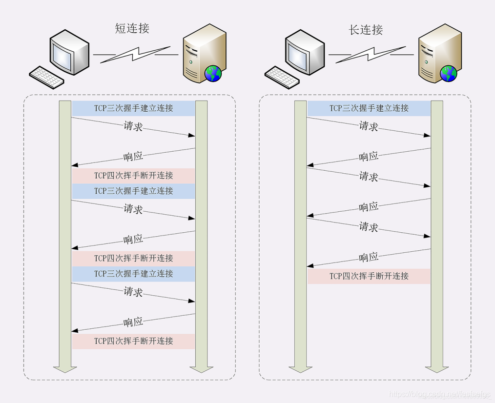</div>
<center>长连接与短连接的区别</center>
<center>（图片来源：<a src="https://blog.csdn.net/fesfsefgs/article/details/108294050">HTTP详解长短连接，管道化，队头阻塞及它们之间的关系</a>）</center>

#### 管道化与非管道化的区别

<div style="text-align: center;">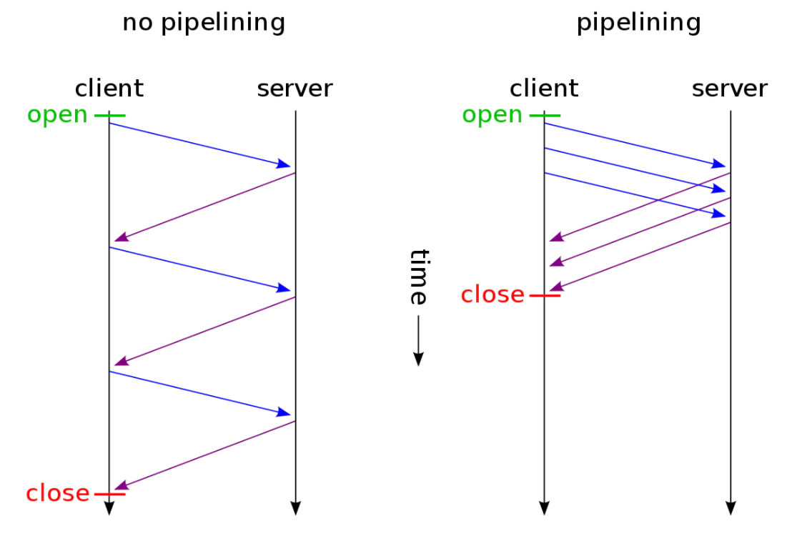</div>
<center>管道化与非管道化的区别</center>
<center>（图片来源：<a src="https://blog.csdn.net/fesfsefgs/article/details/108294050">HTTP详解长短连接，管道化，队头阻塞及它们之间的关系</a>）</center>

#### 队头堵塞

对于 HTTP 1.0，请求的 TCP 连接会被放入到一个队列中，只有当前一个请求的响应收到后，
才会发送下一个请求，如果第一个请求堵塞，则后续的请求也会受到影响。

<div style="text-align: center;">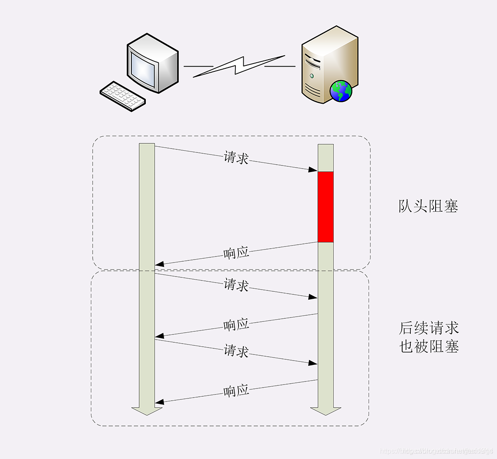</div>

对于 HTTP 1.1，由于采用了管道机制，同一个 TCP 连接可以发送发个请求，也就说请求队列不需要
等待前一个请求收到响应才能发送，这样就解决了队头堵塞的问题。但是，http1.1 规定服务对于客户端
的响应需要**按照发送的顺序**进行响应，也就是**一问一答**的请求响应方式。如果第一个请求的响应时间比较长，则后面的请求也会受到影响（当然，影响比 HTTP1.0 要小），也就说**也会造成队首堵塞**。

<div style="text-align: center;">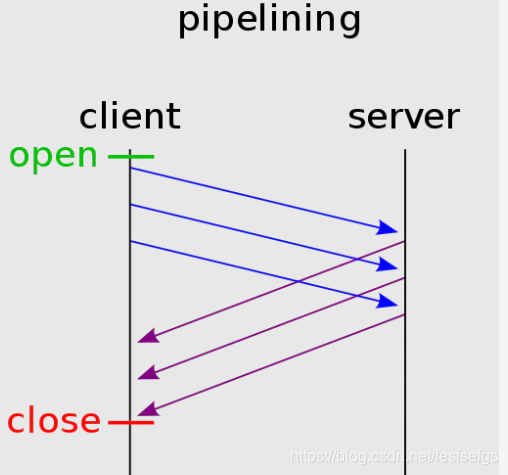</div>

### Q2: HTTP1.1 长连接和 HTTP2.0 多路复用的区别

1. HTTP1.1：同一时间一个 TCP 连接只能处理一个请求，采用的是 一问一答的形式，上一个请求响应后才能处理下一个请求。由于浏览器最大 TCP 连接数的限制，所以有了最大并发请求数的限制。
2. HTTP2.0：同域名下所有通信都在**单个连接**上完成，消除了因为多个 TCP 连接而带来的延迟和内存消耗。单个连接可以并行交错请求和响应，之间互不干扰。

### Q3：为什么 HTTP/1.1 不能实现多路复⽤?

HTTP2.0 是基于二进制帧（Frame）的协议，而 HTTP 1.1 是基于“文本分割” 进行解析的协议。
在 HTTP 1.1 报文结构中，采用换行符分割每一条字段，服务器解析报文需要不断地从读入字节，
直到遇到换行符，这种解析方式可行但是存在一下问题：

1. 一次只能处理一个请求或者响应。这是因为以分隔符分割数据，在完成之前不能停止解析。
2. 解析这种数据无法预知要消耗多少内存，服务器无法提前给要解析的内容分配合适的缓存。

#### 多路复用

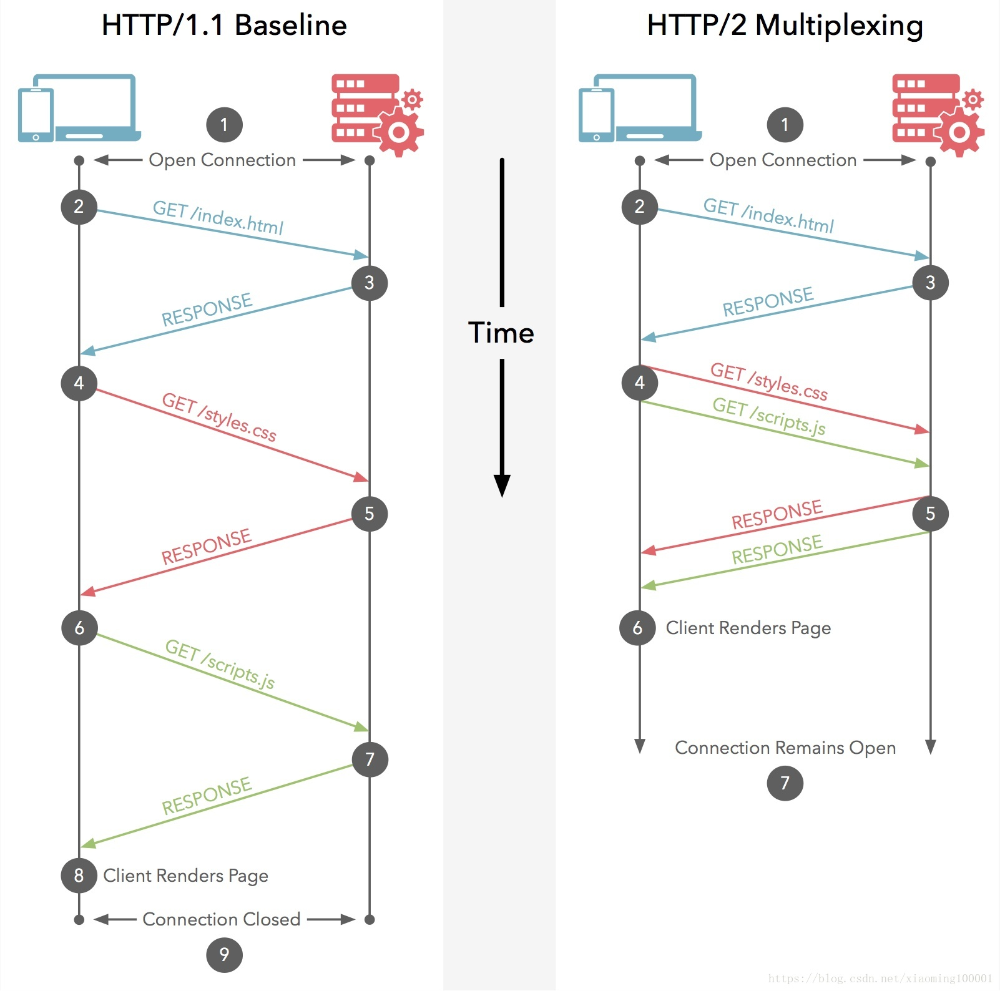

在 HTTP1.1 中，客户端在同以时间内，针对同一域名下的请求有数量的限制，超过限制数的请求
就会阻塞，有些站点为了能够添加并发数，会设置多个静态资源 CDN 域名。

而 HTTP 2.0 采用多路复用来优化这一性能。多路复用允许同时通过一个 TCP 连接发起多个请求，
采用分帧的机制使得并发请求不需要依赖多个 TCP 连接实现。每个数据流可以被拆分成许多独立的帧，
而这些帧可以交错（乱序）发送，还可以设置优先级，达到接收方的时候再将其组合起来。

HTTP2.0 帧可以描述为一下结构：

```
 +-----------------------------------------------+
 |                 Length (24)                   |
 +---------------+---------------+---------------+
 |   Type (8)    |   Flags (8)   |
 +-+-------------+---------------+-------------------------------+
 |R|                 Stream Identifier (31)                      |
 +=+=============================================================+
 |                   Frame Payload (0...)                      ...
 +---------------------------------------------------------------+
```

<table><thead><tr><th style="text-align:left"><div class="table-header"><p>名称</p></div></th><th style="text-align:left"><div class="table-header"><p>长度</p></div></th><th style="text-align:left"><div class="table-header"><p>描述</p></div></th></tr></thead><tbody><tr><td style="text-align:left"><div class="table-cell"><p>Length</p></div></td><td style="text-align:left"><div class="table-cell"><p>3 字节</p></div></td><td style="text-align:left"><div class="table-cell"><p>表示帧负载的长度，默认最大帧大小2^14</p></div></td></tr><tr><td style="text-align:left"><div class="table-cell"><p>Type</p></div></td><td style="text-align:left"><div class="table-cell"><p>1 字节</p></div></td><td style="text-align:left"><div class="table-cell"><p>当前帧的类型，下面会做介绍</p></div></td></tr><tr><td style="text-align:left"><div class="table-cell"><p>Flags</p></div></td><td style="text-align:left"><div class="table-cell"><p>1 字节</p></div></td><td style="text-align:left"><div class="table-cell"><p>具体帧的标识</p></div></td></tr><tr><td style="text-align:left"><div class="table-cell"><p>R</p></div></td><td style="text-align:left"><div class="table-cell"><p>1 位</p></div></td><td style="text-align:left"><div class="table-cell"><p>保留位，不需要设置，否则可能带来严重后果</p></div></td></tr><tr><td style="text-align:left"><div class="table-cell"><p>Stream Identifier</p></div></td><td style="text-align:left"><div class="table-cell"><p>31 位</p></div></td><td style="text-align:left"><div class="table-cell"><p>每个流的唯一ID</p></div></td></tr><tr><td style="text-align:left"><div class="table-cell"><p>Frame Payload</p></div></td><td style="text-align:left"><div class="table-cell"><p>不固定</p></div></td><td style="text-align:left"><div class="table-cell"><p>真实帧的长度，真实长度在Length中设置</p></div></td></tr></tbody></table>
 
http 2.0 是分帧的，请求和响应可以交错复用，为了能发送不同类型的数据信息，通过帧数据传递不同的
内容，HTTP2.0 定义了 10 中不同类型的帧，在 Type 字段中可以对帧类型进行设置：

<table><thead><tr><th style="text-align:left"><div class="table-header"><p>名称</p></div></th><th style="text-align:left"><div class="table-header"><p>ID</p></div></th><th style="text-align:left"><div class="table-header"><p>描述</p></div></th></tr></thead><tbody><tr><td style="text-align:left"><div class="table-cell"><p>DATA</p></div></td><td style="text-align:left"><div class="table-cell"><p>0x0</p></div></td><td style="text-align:left"><div class="table-cell"><p>传输流的核心内容</p></div></td></tr><tr><td style="text-align:left"><div class="table-cell"><p>HEADERS</p></div></td><td style="text-align:left"><div class="table-cell"><p>0x1</p></div></td><td style="text-align:left"><div class="table-cell"><p>包含HTTP首部，和可选的优先级参数</p></div></td></tr><tr><td style="text-align:left"><div class="table-cell"><p>PRIORITY</p></div></td><td style="text-align:left"><div class="table-cell"><p>0x2</p></div></td><td style="text-align:left"><div class="table-cell"><p>指示或者更改流的优先级和依赖</p></div></td></tr><tr><td style="text-align:left"><div class="table-cell"><p>RST_STREAM</p></div></td><td style="text-align:left"><div class="table-cell"><p>0x3</p></div></td><td style="text-align:left"><div class="table-cell"><p>允许一端停止流（通常是由于错误导致的）</p></div></td></tr><tr><td style="text-align:left"><div class="table-cell"><p>SETTINGS</p></div></td><td style="text-align:left"><div class="table-cell"><p>0x4</p></div></td><td style="text-align:left"><div class="table-cell"><p>协商连接级参数</p></div></td></tr><tr><td style="text-align:left"><div class="table-cell"><p>PUSH_PROMISE</p></div></td><td style="text-align:left"><div class="table-cell"><p>0x5</p></div></td><td style="text-align:left"><div class="table-cell"><p>提示客户端，服务端要推送些东西</p></div></td></tr><tr><td style="text-align:left"><div class="table-cell"><p>PING</p></div></td><td style="text-align:left"><div class="table-cell"><p>0x6</p></div></td><td style="text-align:left"><div class="table-cell"><p>测试连接可用性和往返时延（RTT）</p></div></td></tr><tr><td style="text-align:left"><div class="table-cell"><p>GOAWAY</p></div></td><td style="text-align:left"><div class="table-cell"><p>0x7</p></div></td><td style="text-align:left"><div class="table-cell"><p>告诉另外一端，当前端已结束</p></div></td></tr><tr><td style="text-align:left"><div class="table-cell"><p>WINDOW_UPDATE</p></div></td><td style="text-align:left"><div class="table-cell"><p>0x8</p></div></td><td style="text-align:left"><div class="table-cell"><p>协商一端要接收多少字节（用于流量控制）</p></div></td></tr><tr><td style="text-align:left"><div class="table-cell"><p>CONTINUATION</p></div></td><td style="text-align:left"><div class="table-cell"><p>0x9</p></div></td><td style="text-align:left"><div class="table-cell"><p>用以拓展HEADER数据块</p></div></td></tr></tbody></table>

### 非持久连接与持久连接

HTTP1.0 的时候采用的是非持久连接。也就是说，客户端每次向
服务器发送资源请求都需要与服务器建立连接，完成之后客户端会
与服务器断开连接。

而 HTTP1.1 之后采用的是持久连接。也就说，客户端可以在同一个
连接中发次向服务器发送资源请求。

与非持久连接相比，持久连接的响应速度快，消耗的资源也响应要少。

### 为什么是无状态？可以采用什么方式维护状态？

所谓的无状态指的是服务器不保存客户端的连接状态，
当客户端与服务器断开连接后重新连接，服务器无法识别
该用户是否与之前用户相同。

这样做的好处在于服务器不需要额外的开销去保存客户端的
信息。

但是，对于某些情况下，我们需要维持客户端的状态。例如：我们
登录购物网站后，购物网站需要保留我们的信息，以便我们下次
访问的时候可以不再需要登录，同时，购物网站可以
根据保存的客户端的状态，为客户提供定制化的服务。

常见的维护客户端的状态有两种方式：cookie 和 token。

#### cookie

> HTTP Cookie（也叫 Web Cookie 或浏览器 Cookie）是服务器发送到用户浏览器并保存在本地的一小块数据，它会在浏览器下次向同一服务器再发起请求时被携带并发送到服务器上。通常，它用于告知服务端两个请求是否来自同一浏览器，如保持用户的登录状态。Cookie 使基于无状态的 HTTP 协议记录稳定的状态信息成为了可能。-- MDN:HTTP cookies

cookie 可以用来

- 会话状态的管理（如：管理登录状态，购物车等）。
- 个性化定制（如：用户主题定制等）。
- 浏览器行为跟踪（如：跟踪和分析用户的行为）。

事实上，cookie 是一把双刃剑，在提供状态维持的同时，也暴露了一些
危险。例如：黑客可以通过 cookie 进行 [XSS 攻击](https://developer.mozilla.org/zh-CN/docs/Glossary/Cross-site_scripting)。

为了避免遭受 XSS 攻击，可以在设置 cookie 的时候添加一个 `HttpOnly`，
这样客户端就无法通过脚本（`document.cookie`）的方式得到 cookie，
从而避免 XSS 攻击。

#### token

Token 也可以用来维护客户端的状态。当客户端访问我们的
服务器的时候，我们为其发放一个 token，用来标识当前的
客户。同时，我们可以利用这个 token 作为唯一的标识来存储
客户端的访问信息，从而实现状态的维护。

相比于 cookie 保存在客户端，token 是保留在服务端的，这种
方式会相对安全。

### Web 缓存（代理服务器）

使用代理服务器的目的是为了让客户端在不访问
原始服务器就能获得相应的资源。具体实现原理如下：

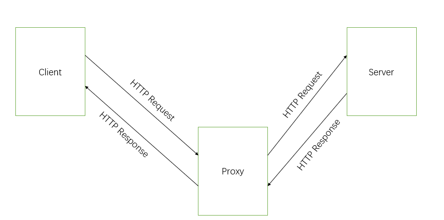

1. 代理服务器访问原始服务器获取资源，然后存储到代理服务器上。
2. 客户段访问代理服务器，获取相应的资源。

从上图可以看出，代理服务器既是客户端又是服务器。通常，代理服务器
是由 ISP（如：联通、移动、电信）安装。

使用 代理服务器的好处在于：

1. 降低客户端的请求响应时间。由于代理服务器通常是在本地局域网内，
   所以客户端访问代理服务器获取资源的速度要比直接到原始服务器上
   获取资源要快。
2. 降低原始服务器的请求压力。这是由于代理服务器分担了一部分的请求压力。

## HTTPS

### 为什么需要 HTTPS

由于 HTTP 采用的是明文传输的方式，客户端与服务器之间的通信很容易被黑客所窃取，存在安全性问题。

<div style="text-align: center;">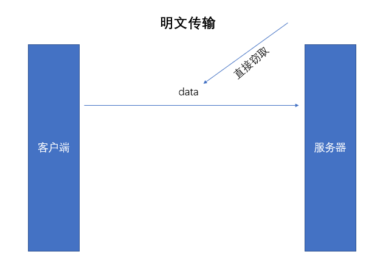</div>

### 工作原理

既然明文传输行不通，那么我们可以对传输的数据进行加密，常见的加密方式有两种：

1. 对称加密。
2. 非对称加密。

对称加密的原理大致如下：

我们有一个加密的算法 f 已经密钥 k。
使用算法 f 和密钥 k 对数据 data 进行加密，我们就可以得到加密后的数据 x。即，
$$f(k, data) = x$$

而解密过程就是将机密后的数据 x 利用算法 f 和密钥 k 解密得到数据 data，即
$$f(k, x) = data$$

看起来这种加密方式可以避免黑客的攻击，但是由于服务器无法知道将会有多少个客户端连接，
如果为每一个客户端都分配一个 key 的话，那么服务器存储的压力显然是巨大的，所以一般会
采用一个 key。

但是，如果只有一个 key 的话，黑客也能拿到 key，只要能推测出服务器采用的加密算法，就可以
对传输的数据进行解密。

某种意义上讲，对称加密只能防君子但防不了小人。

那么，采用非对称加密会怎么样？

非对称加密包含 公钥（public key）和私钥（private key）还有一个算法。
我们暂且把公钥记为 pk，把私钥积为 sk。则非对称加密可以描述为以下过程：
$$ f(pk, data) = y (1)$$
$$ f(sy, y) = data (2)$$
$$ f(sk, data) = y' (3)$$
$$ f(pk, y') = data(4)$$

(1) 使用公钥 pk 对数据 data 进行加密得到加密后的数据 y。

(2) 使用私钥 sk 对加密后的数据 y 进行解密得到数据 data。

(3) 使用私钥 sk 对数据进行加密得到加密后的数据 y'。

(4) 使用公钥 pk 对加密后的数据 y' 进行解密得到数据 data。

<div style="text-align: center;">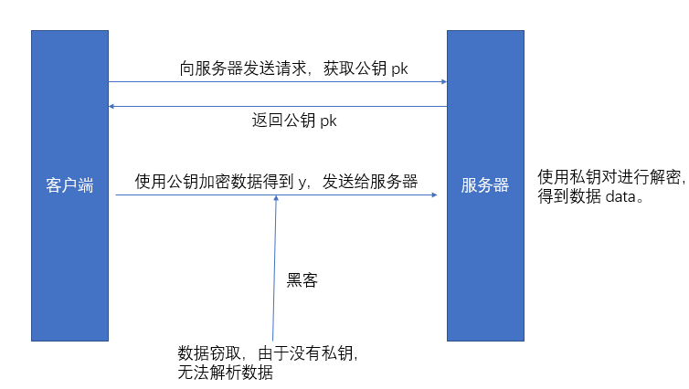</div>

从上图我们可以知道数据的传输过程，似乎使用非对称加密后，黑客窃取数据后无法从中
得到有用的信息。

但是问题来了，服务器怎么向客户端发送数据？首先，服务器不能使用公钥进行加密，
这是因为加密后的数据只能通过私钥进行解密的，而客户端又没有私钥。那如果采用
私钥进行加密呢？确实客户端可以对加密后的数据进行解密，但是黑客同样也可以解密，
黑客同样也可以向服务器索要公钥进行解密。

让我们来从新审视上面两种加密算法。对于对称加密只有一个公钥，如果我们能对每一个客户端
都有一个公钥的话，那么就可以实现安全传输了（至于为什么行不通前面已经讲过了）。
对于非对称加密，客户端向服务器发送数据的时候是安全的，而服务器向客户端发送数据的时候
是不安全的。

那么，是否可以结合对称加密和非对称加密的优势对数据进行传输呢？
考虑下面的一种方案：

1. 先使用非对称加密的方式，在服务器与客户端之间协商出一个临时制定的 key。
2. 协商出临时的 key 后，再采用对称加密的方式进行数据的交互。

由于一开始的 key 是由客户端与服务器协商出来的，也就是每个客户端与服务器交流的时候
的 key 不一样，这不就是我们一开始采用对称加密所要达到的效果的？具体的实现过程可以参考下图：

<div style="text-align: center;">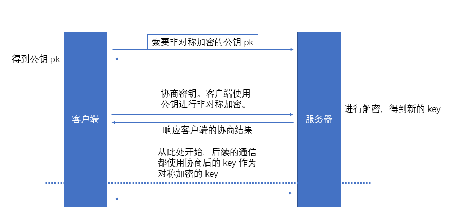</div>

在第一步的时候，我们前已经分析过了，采用非对称加密的方式，客户端向服务器发送请求是安全的。
所以客户端与服务器协商的 key 也是安全的。

后续的交流采用协商出来的 key 作为对称加密的密钥对数据进行加密，即使是黑客窃取到
数据包，但是没有密钥，很难解析出想要的数据。

采用上述的方式进行数据的传输似乎是无懈可击的，但是道高一尺魔高一丈，来看黑客如何破解此类难题的。

假设我们上面第一步（向服务器请求公钥的过程）就被黑客所拦截了，那么黑客完全可以作为
我们与服务器交流的中间人，后续我们与服务器的通信实际上是在于中间人进行通信，中间人
帮我们转发请求，同时对于敏感数据进行窃取。甚至还可以私下与服务器进行通信。这种完全的
问题称为中间人攻击。

<div style="text-align: center;">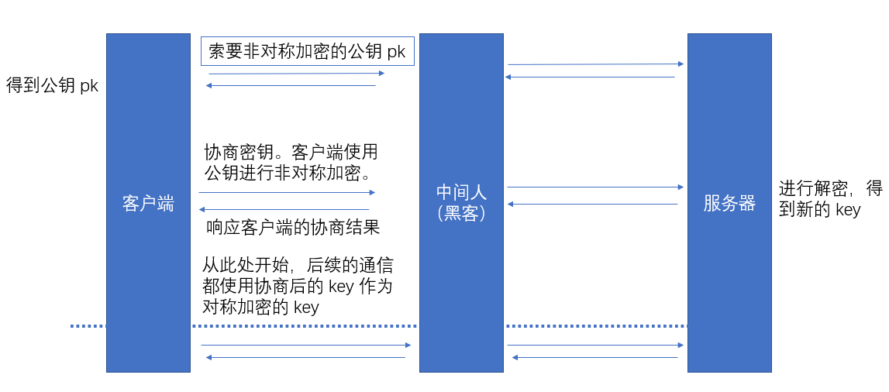</div>

中间人产生的原因是我们一开始去请求公钥的时候就被中间人所拦截，那么有什么办法避免此类
攻击呢？

事实上，解决这个问题非常简单。导致这个问题的核心是因为我们不知道一开始得到的公钥是否
安全，那么我们可以引入一个 CA（Certificate Authority），只有经过 CA 认证的公钥才是
好公钥，其他的公钥我们可以认为是被中间人拦截过的公钥。

<div style="text-align: center;">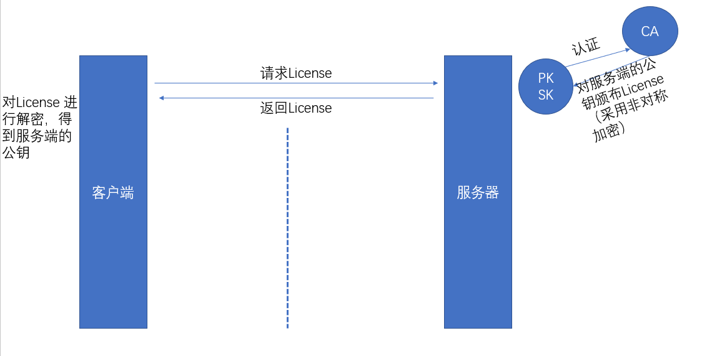</div>

由于 license 经由权威机构进行认证的，所以是安全可靠的。也就保证了后续的数据通信的安全。
事实上，我们还有一个步骤需要注意，就是我们对 License 进行进行解密的过程。由于 License 采用
的是非对称加密的方式，那么我们还需要向 CA 请求公钥，这个过程也有可能被黑客进行拦截。
为了解决这个问题，CA 认证的公钥直接写入到浏览器或者操作系统中了。

上面我们对用户与服务器协商密钥的过程只是一笔带过，但实际上这个过程是非常复杂的。

1. 客户端向服务器发起请求。请求中需要携带本机支持 SSL 的版本以及非对称加密的算法还有协商的随机数 1。
2. 服务器响应客户端的请求。确定采用 SSL 版本，确定采用的对称算法，设置随机数 2，返回 License。
3. 客户端对 License 进行认证。
4. 认证成功，客户端向服务器发送数据。发送随机数 3，以及 hash(1, 2)（对前面的过程进行 hash）。
5. 服务器接收到客户端的数据。先验证 hash(1, 2) 是否正确。然后通过特殊的算法将前面的随机数 1, 2, 3 生成一个 key。
6. 服务器响应客户端。返回 hash(1, 2, 4)
7. 客户端接收到服务器的响应。先验证 hash(1, 2, 4) 是否正确。然后再通过协商的算法根据随机数 1, 2, 3 生成 key。

可以看到客户端于服务器协商 key 的过程都是再各自环境下执行的，所以不会泄漏任何数据。

总结一下，HTTPS 采用了**非对称算法** + **对称算法** + **hash** + **CA** 认证的方式来确保客户端于服务器之间通信的安全。

### HTTPS 可以做什么

1. 保密性。用户的连接将会被加密，URL 会被隐藏，cookie 和其他敏感数据也会被加密。
2. 权威性。确保用户访问的是真实的网站，而不会访问到“中间人”提供的网站。
3. 可靠性。确保数据在传输过程中不会被篡改。

### HTTPS 可以保护那些信息

HTTPS 会加密客户端与服务器交流的所有数据。包括 URL 和请求头、请求体。

### HTTPS 对 SEO 的影响

这是因为 Google 修改了网页排名的规则，采用 HTTPS 的网站将会得到更高的排名。

一个可行的建议是：采用 301 HTTP status 将用户重定向 从 `http://` 到 `https://`，
而不是使用 302 HTTP status 进行重定向。

## Other

### GET 与 POST 的区别

GET:

- GET 请求可以被缓存
- GET 请求可以保留在浏览器历史记录中
- GET 请求可以被收藏为书签
- GET 请求**不应该**在处理敏感数据是使用
- GET 请求中 URL 有长度的限制
- GET 请求最好用于取回数据

POST：

- POST 请求不会被缓存
- POST 请求不会保留在浏览器历史记录中
- POST 请求不能被收藏为书签
- POST 请求数据的长度没有要求

### 浏览器缓存

浏览器的缓存可以划分为如下三类：

1. service worker
2. memory cache
3. dist cache

优先级从上到下依次递减。

其中，memory cache 是浏览器为了加快读取速度而进行自身优化的行为，不受开发者影响，
也不受 HTTP 协议头约束。Service Worker 是由开发者编写的额外的脚本，作为发起请求的
中间人。日常开发最常见的一种缓存就是 disk cache，它需要遵守 HTTP 协议头的字段，我们
日常所说的**强制缓存**，**协商（对比）缓存**还有 `Cache-control`等都归于此类。

#### 强制缓存

强制缓存也叫强缓存。强制缓存是指客户端发送请求后，会先访问缓存数据库，看缓存数据库中
是否还有想要的数据。如果存在则返回响应数据；如果不存在则向服务器发送请求，得到响应后
再写入缓存数据库中。

强制缓存的直接结果是**减少请求的次数**，降低响应时间。可以造成强制缓存的字段是
`Cache-control` 和 `Expires`。

其中，`Expires` 是 HTTP 1.0 的字段，标识缓存到期的时间，是一个绝对的时间，例如：
`Expires: Thu, 10 Nov 2017 08:45:11 GMT`。

在响应消息头中，设置这个字段之后就可以告诉浏览器，在未过期之前不需要再次请求。

但是这个字段存在两个缺点：

1. 由于采用绝对时间，如果客户端修改了本地时间，会导致浏览器缓存失效，而需要再次请求资源。
   此外，时差等因素也会导致客户端于服务器的时间不一致。
2. 写法比较复杂。标识时间的字符串中多了个空格，少了个字母都会导致非法属性而设置失效。

`Cache-control` 则是 HTTP 1.1 新增加的字段，该字段表示资源缓存的最大有效时间，
在该时间内，客户端不需要再向服务器发送请求。

两个字段之间的区别在于前者采用的是绝对时间，而后者采用的是相对时间，例如：
`Cache-control: max-age=2592000`。表示在上次请求时间后 2592000 秒内不要
再发请求。

常见的 `Cache-control` 字段值有：

1. `Cache-control: max-age=<seconds>`：最大有效时间。
2. `Cache-control: must-revalidate`：如果超过了最大有效时间，浏览器必须向服务器发送请求，验证资源是否有效。
3. `Cache-control: max-age=<seconds>`：最大有效时间。
4. `Cache-control: no-cache`：字面上是“不要缓存”，但实际上表示的是在使用缓存响应客户端之前，**强制(MUST)**要求将客户端的请求提交给原始服务器进行验证（也就是协商验证）。
5. `Cache-control: no-store`：不适用任何缓存。
6. `Cache-control: public`：表明响应可以被任何对象（包括：发送请求的客户端，代理服务器，等等）缓存，即使是通常不可缓存的内容。
7. `Cache-control: private`：表明响应只能被单个用户缓存，不能作为共享缓存（即代理服务器不能缓存它）。私有缓存可以缓存响应内容，比如：对应用户的本地浏览器。

这些值还可以混合使用，需要遵守一定的优先级。

从 HTTP/1.1 开始，`Expires` 逐渐被 `Cache-control` 取代。即使同时使用了两个字段，
`Cache-control` 的优先级要**高于** `Expires`。一般而言，为了兼容 HTTP/1.0，实际
项目都会设置两个字段。

#### 协商缓存

当强制缓存失效（超时）的时候，就需要使用对比缓存，又服务器决定缓存的内容是否失效。
从流程上说，浏览器会先请去缓存数据库，返回一个缓存标识符。之后浏览器会根据这个标识符
与服务器进行通信，如果服务器返回的 HTTP 状态码为 304 的话，表示缓存未失效，客户端可以继续
使用缓存中的数据。否则，服务器会返回新的数据和缓存规则，浏览器响应数据后，再把规则写入到数据库中。

协商缓存再请求数上与没有缓存是一样的，但是如果协商缓存成功返回 304 状态码时，它
实际上不会包含其他内容信息，因此，再响应要比直接请求快。

一般而言，再项目中会同时使用协商缓存和强制缓存，协商缓存作为强制缓存失效后的候选方案。

协商缓存有两**组**字段：

`Last-Modified & If-Modified-Since`

1. 服务器通过 `Last-Modified` 字段告知客户端，资源最后一次修改的时间，例如：
   `Last-Modified: Mon, 10 Nov 2018 09:10:11 GMT`
2. 浏览器将这个值和内容一起记录到缓存数据库中。
3. 下一次请求相同资源的时候，浏览器会先从自己的缓存数据库中找出响应的资源，然后
   在请求头中将上次 `Last-Modified` 的值写入请求头的 `If-Modified-Since` 字段中。
4. 服务器会将 `If-Modified=Since` 与 `Last-Modified-Since` 字段进行对比，如果相等，
   则表示未被修改，返回响应状态码 304；否则，表示已经修改，返回响应数据和响应状态码 200。

上面的做法是存在缺陷的：

1. 如果请求的更新速度在**秒**一下时，那么该缓存是不能被使用的，这样浏览器就缓存了大量无用的数据。
2. 如果文件是服务器动态生成的，那么该方法的更新时间永远是生成时间，尽管文件没有变化，这样也起不了缓存的效果。

`Etag & If-None-Match`

为了解决上述问题，就出现了 `Etag` 和 `If-None-Match` 字段。
`Etag` 存储的是文件的特殊标识符（一般是有 hash 生成的），服务器存储文件的 `Etag` 字段，
后面的操作跟 `Last-Modified & If-Modified-Since` 一样，只是 `If-Modified-Since` 变成
了 `If-None-Match`。而且 `Etag` 的优先级要高于 `Last-Modified`。

下面是第一次请求资源时服务器的响应：

<div style="text-align: center;">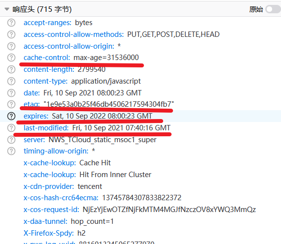</div>

下面是第二次请求相同资源浏览器发送的请求和服务器返回的响应，可以看到我们上面
描述的内容基本印证。

<div style="text-align: center;">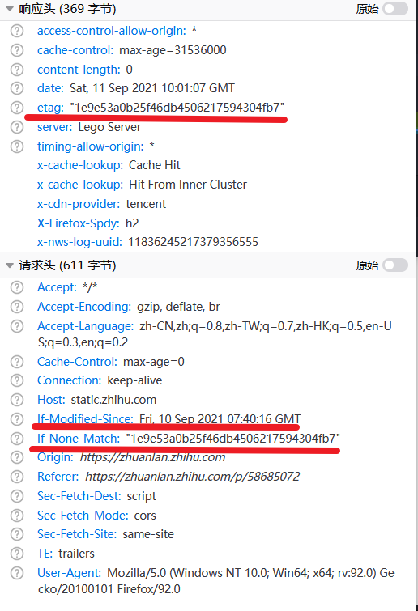</div>

## Reference

- [什么是 URL？](https://developer.mozilla.org/zh-CN/docs/Learn/Common_questions/What_is_a_URL)
- [HTTP request methods](https://developer.mozilla.org/en-US/docs/Web/HTTP/Methods)
- [HTTP response status codes](https://developer.mozilla.org/en-US/docs/Web/HTTP/Status)
- [HTTP 详解长短连接，管道化，队头阻塞及它们之间的关系](https://blog.csdn.net/fesfsefgs/article/details/108294050)
- [HttpOnly](https://owasp.org/www-community/HttpOnly)
- [HTTP 与 HTTPS 的区别](https://www.runoob.com/w3cnote/http-vs-https.html)
- [http/2.0“多路复用”实现原理](https://cloud.tencent.com/developer/article/1551667)
- [Hypertext Transfer Protocol Version 2 (HTTP/2)](https://httpwg.org/specs/rfc7540.html#FramingLayer)
- [深入理解 http2.0 协议，看这篇就够了！](https://zhuanlan.zhihu.com/p/89471776)
- [Introduction to HTTPS](https://https.cio.gov/faq/#)
- [一文读懂前端缓存](https://zhuanlan.zhihu.com/p/44789005)
