数据通过网络进行传输的思路：

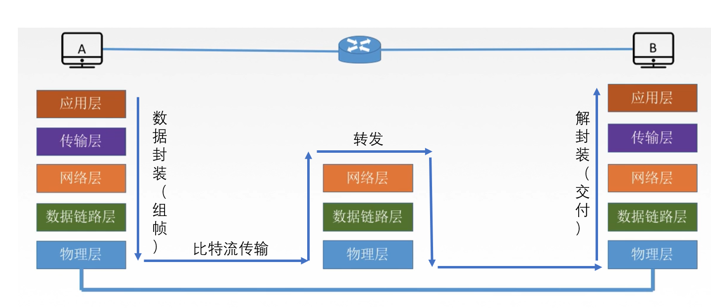

在链路层中，我们不必关系数据流动的每一个细节，我们
只需要关心两个数据链路层之间数据的传输，如下图所示：

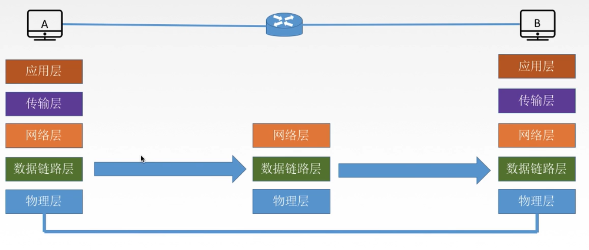

## 基本概念

1. 结点：主机、路由器
2. 链路：网络中的两个结点之间的**物理通道**。链路的传输介质主要有（分为有线链路和无线链路）

   - 双绞线
   - 光纤
   - 微波

3. 数据链路：网络中的两个结点之间的**逻辑通道**，把实现控制数据
   传输**协议**的硬件和软件加到链路上就构成数据链路。
4. 帧：链路层的协议数据单元，封装网络层的数据报。

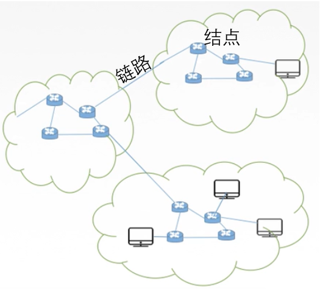

**如何区分链路和数据链路**：看结点之间的**通道**，如果是物理通道为链路，如果是逻辑通道为数据链路。

## 链路层的功能

数据链路层负责通过一条链路从一个结点向另一个物理链路直接相连的**相邻**
结点传送数据。

即，数据链路层在物理层提供服务基础上**向网络层提供服务**（下层为上层提供服务，
上层使用下层提供的 API），其最基本的服务是将来自网络层的数据**可靠**地传
输到相邻结点的目标网络层。其主要作用是**加强物理层传输原始比特流的功能**，将
物理层提供的可能出错的物理连接改造成**逻辑上无差错的数据链路**，使之对网络
层表现为一条无差错的链路。

用下面的一张图来描述网络层、数据链路层、物理层的关系：

网络层通过数据链路层传输数据，而链路层不可能自己亲自交付数据，所以把数据进行一次封装（编号）
送给底层的物理层，而物理层只负责二进制数据的传输，中间可能出现差错，所以在连一端，数据链路层
需要对物理层传输过来的数据进行校验，确保数据的可靠性，然后再向上层（网络层）交付。

数据链路层有如下功能：

1. 为网络层提供服务。

   - 无确认无连接服务。
   - 有确认无连接服务。
   - 有确认面向连接服务。

2. 链路管理。即建立、维持、释放连接（用于面向连接服务）
3. 组帧。
4. 流量控制。
5. 差错控制（分为帧错和位错）。

### 组帧

组装成帧的过程可以参考下图：

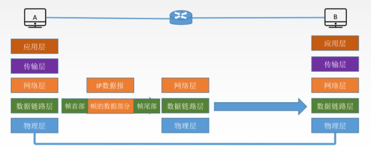

将网络层提供的 IP 数据报，加上帧头和帧尾构成帧。

**封装成帧**：在一段数据报的前后添加上帧头和帧尾的过程。接收端在收到物理层交付的比特流后，
根据帧头和帧尾的标记就可以从收到的比特流中识别出帧的开始和结束。

帧头和帧尾包含很多**控制信息**，最重要的作用是**帧定界**。
（虽然有很多控制信息，只有帧定界符才能起到帧定界的作用）

**帧同步**：接收方从接收到的二进制比特流中识别出帧的起始和帧的终止。

**MTU**：最大传送单元。不同协议规定了帧的最大传送单元。
（要提高数据传输的效率，就要尽可能地提高数据在整个帧的占比）

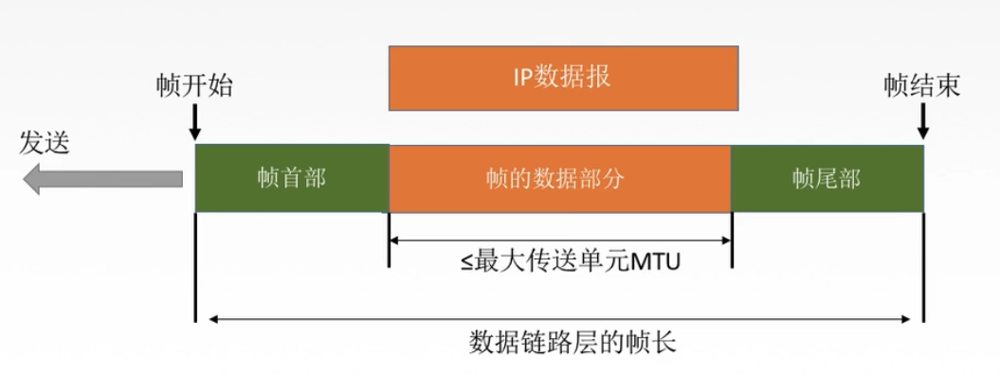

封装成帧

常见的组帧方法：

1. 字符计数法。
2. 字符填充法。
3. 零比特填充法。
4. 违规编码法。

在具体介绍组帧方法之前，先了解一下什么是透明传输。

**透明传输**指的是不管所传输的数据是什么样的比特组合，都应当
能够在链路上传送。链路层“看不见”有任何妨碍数据传输的东西。

当所传输数据中的比特组合恰巧与某个控制信息一样时，就应当采取适当的
措施，使接收方不会将这样的数据误认为是某种控制信息。这样才能保证
数据链路层的传输的透明的。

#### 字符计数法

帧首部使用一个计算字段（第一个字节，八位）来标明帧内字符。

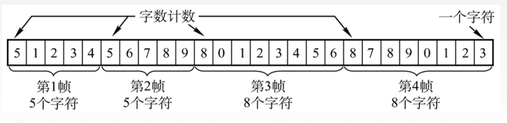

**缺点**：一旦传输过程出现差错，整个帧都会出错。

#### 字符填充法

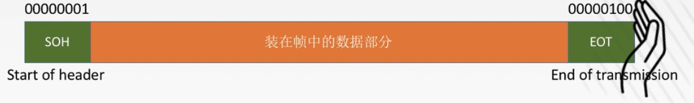

采用特殊字符作为帧首部的开始和结束。

当传送的帧是由文本组成时，可以实现透明传输。（文本尾 ASCII 组成，
一般不会于帧定界符重合）

但是，但传送的帧是非 ASCII 数据时，就有可能出现错误，接收方可能会
误识别帧结尾：

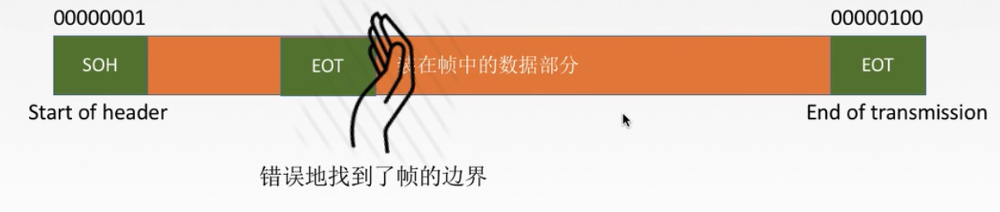

为了避免上述的情况出现，我们可以采用转义字符对特殊字符进行转移：

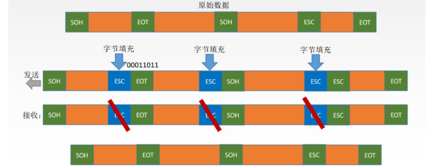

#### 零比特填充法

采用 0111110 作为帧定界符。如果在组帧的过程中出现 0111110，即出现
连续的 5 个 1 时，就立刻填入 0，避免于帧定界符相同。

接收方接收到数据帧先识别出帧头和帧尾，解封装的过程中，发现有连续的 5 个 1，就把其后面的 1 个 0 删除即可。

#### 违规编码法

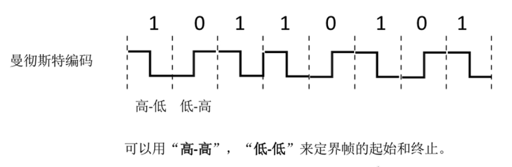

### 差错控制

差错从何而来？简而言之，传输中的差错都是由噪声引起的，又分为全局性和局部性：

1. 全局性：由于线路本身的电气特性所产生的**随机噪声**，是信道固有的，随机产生的。解决办法：提高信噪比来减少噪声或避免干扰。
2. 局部性：外界特定的短暂缘故所造成的**冲击噪声**，是产生差错的主要原因。解决办法：通过编码技术解决。

常见的差错类型：

1. 位错（比特位出错）。0 变成 1，或 1 变成 0。
2. 帧错。
   - 丢失。例如：我们想要收到 [#1]-[#2]-[#3]，但是接收方只收到 [#1]-[#3]。
   - 重复。例如：我们想要收到 [#1]-[#2]-[#3]，但是接收方收到 [#1]-[#2]-[#2]-[#3]。
   - 失序。例如：我们想要收到 [#1]-[#2]-[#3]，但是接收方收到 [#1]-[#3]-[#2]。

链路层的差错控制主要是比特错。之所以在路由转发的时候也要经过链路层，
可以在出现错误时，及早将错误的帧丢弃。

常用的检错编码有：

1. 奇偶校验
2. 循环冗余码校验。

常用的纠错编码有：

1. 海明码。

### 流量控制

为什么需要流量控制？
这是因为**较高的发送速度**和**较低的接收速度**导致能力不匹配，
会造成传输出错。

流量控制在链路层和传输层都存在，区别是：

- 链路层的流量控制是点对点的，而传输层的流量控制是端到端的。
- 链路层的流量控制收到是：接收方收不下就不返回回复确认帧。而传输层的流量控制是给接收方给发送方一个窗口公告，告诉发送方还可以接收多少数据。

下面是链路层的流量控制手段：

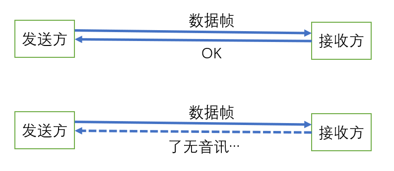

主要的流量控制方法：

1. 停止等待协议。每发送完一个帧就停止发送，等待对方的确认，在收到确认后再继续发送下一帧。

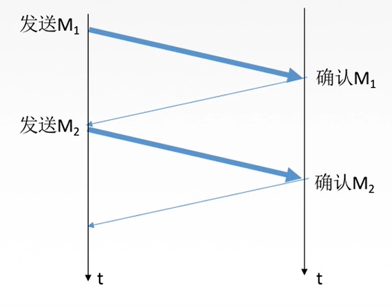

停止等待协议

2. 滑动窗口协议。
   - 后退 N 帧协议（GBN）。
   - 选择重传协议（SR）。

滑动窗口指的是发送方接收到确认帧后，发送窗口往前移动的过程。
事实上，停止-等待协议可以看成是特殊的滑动窗口协议，只是它的
滑动窗口的大小为 1。

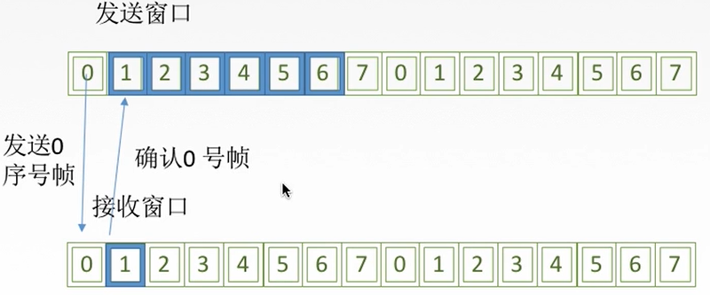

几种协议窗口大小的对比：

|   协议    |          窗口大小           |
| :-------: | :-------------------------: |
| 停止-等待 | 发送窗口 = 1，接收窗口 = 1  |
| 后退 N 帧 | 发送窗口 > 1，接收窗口 = 1  |
| 选择重传  | 发送窗口 > 1 ，接收窗口 > 1 |

#### 停止-等待协议

1. 为什么需要停止-等待协议？

   - 数据在传输的过程中除了**比特错**，还可能出现丢包问题。
   - 实现流量控制。

2. 研究停止-等待协议的前提。
   - 为了讨论问题的方便，仅考虑一方发送数据，一方接收数据。
   - 停止-等待协议就是每发送一个分组后就停止发送，等待对方确认，
     收到确认后再发送下一个分组。
3. 停止-等待协议的几种应用情况。
   - 无差错。
   - 有差错。

对于无差错情况如下：

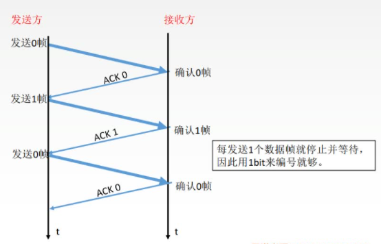

无差错情况

对于有差错的情况如下：

1. 数据帧丢失或检测到帧出错。

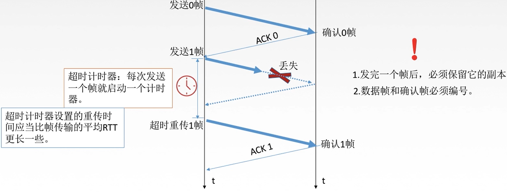

2. ACK 丢失。

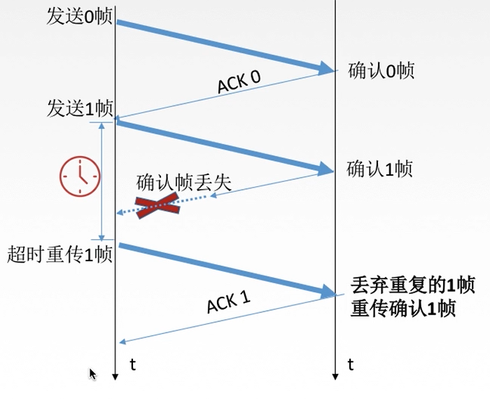

3. ACK 迟到。

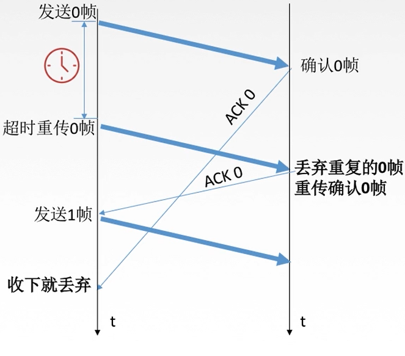

**优缺点**

1. 优点。

   - 简单

2. 缺点。
   - 信道利用率（发送方在一个发送周期内，有效的发送数据所需要的时间占总体的时间的比率）低，

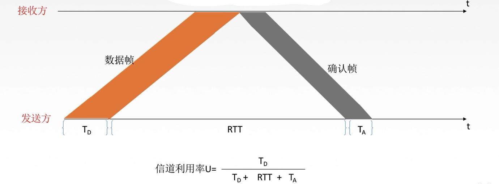

正因为停止-等待协议信道利用率低的特点才有了 SR 和 GBN 协议。

#### 后退 N 帧协议 （GBN）

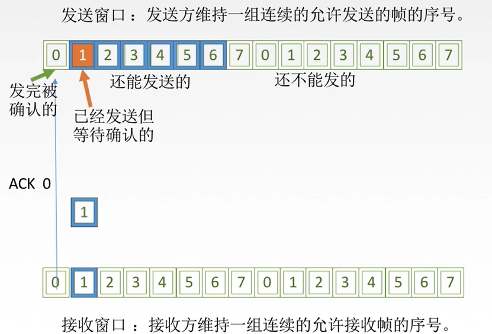

发送方需要做的事：

1. 响应上层的调用。上层要发送数据时，发送方先检查发送窗口是否已经满了，如果没有满，则产生一个帧并将其发送，如果窗口已经满了，则发送方只需要将数据返回给上层，暗示上层窗口已满。（也可以缓存部分数据）
2. 收到 ACK。在 GBN 协议中，对于 n 号帧的确认采用的是 **累计确认**的方式实现的，表明接收方已经收到 n 号帧**以及它之前的全部帧**。
3. 超时事件。出现丢失和延迟时，发送方将重新发送以发送但为确认的**所有**帧。

核心需要掌握的内容：

1. 累积确认。
2. 接收方按序接收帧。
3. 接收方只确认序列号最大，按序到达的帧。
4. 发送方窗口大小为 $2^{n} - 1$，接收方窗口大小为 1。

性能分析：

- 优点：相比与停止等待协议，GBN 协议充分利用了信道。

- 缺点：在重传的时候，把原来已经正确传送的数据帧重发，传送效率低。

#### 选择重传协议（Selective Repeat）

我们再来看 GBN 协议它的特点：累计确认。正是这种累积确认机制导致
它在出现异常的情况下也会选择忽略已经正确接收到的非顺序的帧。

选择重传也是来解决此类问题的，通过为接收方也分配一个滑动窗口，
制定相应的规则从而提高传输的效率。

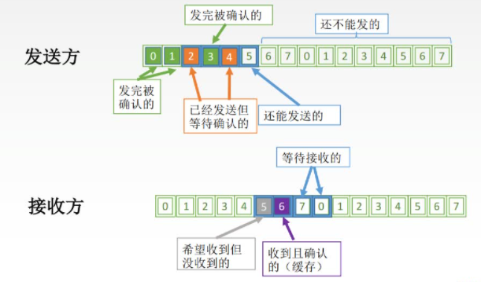

采用 SR 协议选知道的几个事项：

1. 上层调用。
   - 上层要发送数据的时候，发送方会检查发送窗口是否已满，如果未满，则
     产生一个帧并将其发送；如果窗口已经满了，则发送方只需要将数据返回给上层或者将其缓存下来。
2. 收 ACK。
   - 如果收到 ACK，加入该帧序号的窗口内，则 SR 发送方将那个被确认的帧
     标记为已接收。如果该帧序号是在窗口的最下界，则窗口向前移动到具有
     最小未确认的帧处。如果窗口发送移动，并且有序号在窗口内有未发送帧
     ，则发送这些帧。

<!-- ## 链路层的两种信道

## 局域网、广域网及其协议

## 链路层设备

### 交换机

### 网桥 -->

## Reference

- [王道计算机考研 计算机网络](https://www.bilibili.com/video/BV19E411D78Q?p=19)

## Appendix

### 信道利用率

$信道利用率 = \dfrac{L / C}{ T}$

- L: T 时间内发送的比特数 L。
- C: 发送方的发送速率。
- T: 发送周期。

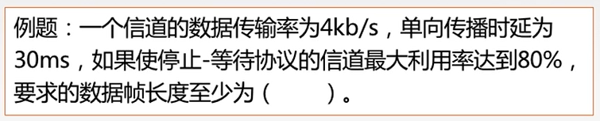

由于题目没有给出接收方的接收时延，假设接收方的接收时延为 0。

则 $T = L / C + 2 * RTT + 0 = L / 4 + 2 * 30$

$80\% = \dfrac{ L / 4}{ L / 4 + 2 * 30 + 0}$

解得: $L  = 960 bits$。(注意单位的转换)
