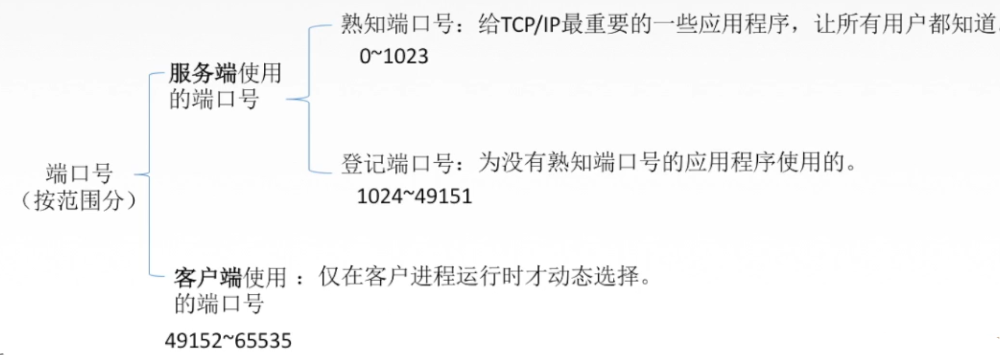
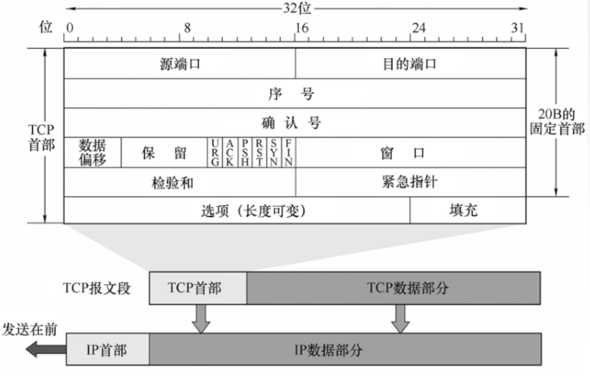
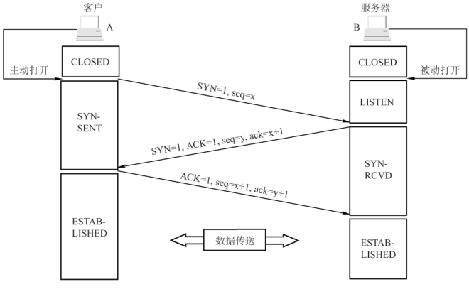
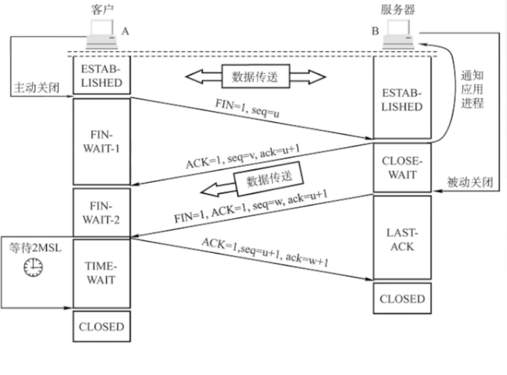
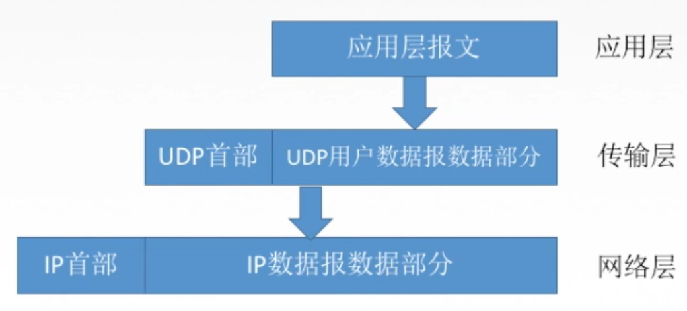
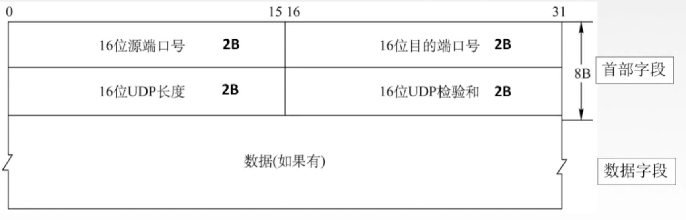
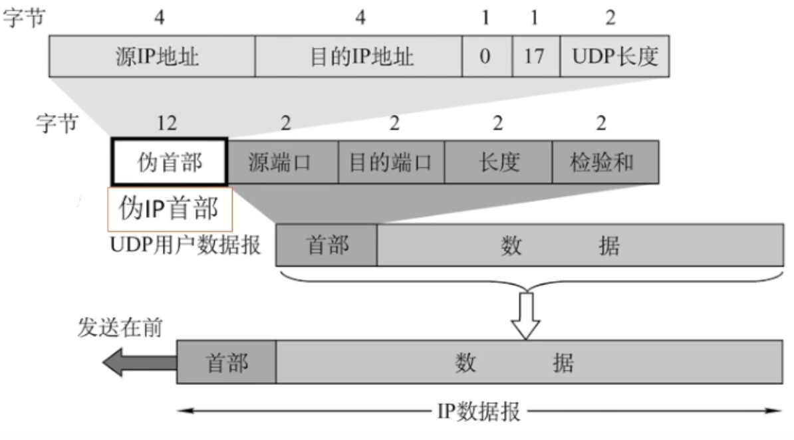
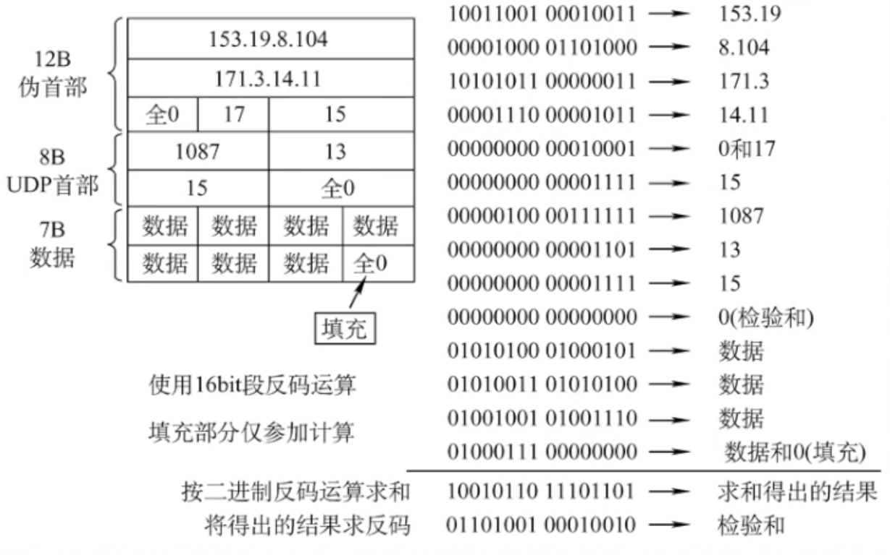

## 传输层概述

传输层位于 OSI 参考模型的第四层。位于五层体系结构中的第 4 层，是主机
采用的层次。

在五层体系中，传输层位于网络层和应用层之间，可以使用下层（网络层）提供
的服务，同时，为上层（应用层）提供服务。

### 传输层的功能

1. 提供进程与进程之间逻辑通信。
2. 复用和分用。
   - 复用：发送方不同的进程都可以使用同一个传输层协议传送数据。
   - 分用：接收方的传输层在剥去报文首部后能够把这些数据正确交付到目的
     进程.
3. 对收到的报文进行差错检测。

### 传输层分用的原理

在网络层中，我们可以通过 mac 地址来标识唯一的主机。而在
传输层中，我们可以通过端口号来标识唯一的进程。

通过 socket 我们就可以标识网络中的唯一一个主机以及上面的进程。
( socket = (ip, port) )

## TCP 协议

TCP 协议是一种**面向连接**的传输控制协议。
使用 TCP 传输数据之前都必须建立连接，数据传送结束后要释放连接。
不提供广播或多播服务。由于 TCP 要提供**可靠传输**的**面向连接**
的传输服务，因为不可避免增加了许多开销，如：确认、流量控制、计时器
以及连接管理等。

特点：

1. TCP 是面向连接（虚连接）的传输层协议。
2. 每一条 TCP 连接只能有两个断电，每一条 TCP 练级额只能是点对点的。
3. TCP 提供可靠交付的服务，无差错、不丢失、不重复、按序到达（可靠有序，不丢不重）
4. TCP 提供全双工通信。

   - 发送缓存：准备发送的数据和已经发送但未接收到确认的数据。
   - 接收缓存：按需达到但尚未接受应用程序读取的数据和不按序到达的数据。

5. TCP 面向字节流。TCP 把应用层交付下来的数据看成仅仅是一连串的无结构的**字节流**。

### 报文段格式

TCP 采用的是 0 比特填充法来确保 TCP 报文段是 4 bytes 的整数倍。

TCP 报文段**首部**的长度为 20 bytes 的固定首部 + 选项字段。

TCP 报文段中每个字段的含义：

|         字段         |                                       大小                                        |                                                                                      解释                                                                                       |
| :------------------: | :-------------------------------------------------------------------------------: | :-----------------------------------------------------------------------------------------------------------------------------------------------------------------------------: |
|       源端口号       |                                      8 bits                                       |                                                                                                                                                                                 |
|      目的端口号      |                                      8 bits                                       |                                                                                                                                                                                 |
|         序号         |                                      32 bits                                      |                                     在一个 TCP 连接中传送的字节流中的每一个字节都按照顺序编号，序号字段表示所要发送数据的**第一个字节序号**                                     |
|        确认号        |                                      32 bits                                      |                                **期望**收到对方下一个报文段的第一个数据字节序号。若确认号为 N，则证明到 序号 N - 1 为止的所有数据都已经确认收到                                 |
| 数据偏移（首部长度） |                                      4 bits                                       | 数据偏移字段也就首部长度字段。TCP 报文段的**数据**起始处距离 TCP 报文段的起始处距离，是以 4 bytes 为单位。例如：TCP 数据偏移字段为 b1111，则 TCP 报文首部长为 15 × 4 = 60 bytes |
|         保留         |                                      7 bits                                       |                                                                                                                                                                                 |
|        控制位        |                                      6 bits                                       |                                                                                                                                                                                 |
|         窗口         |                                      16 bits                                      |                                                                                发送方的接收窗口                                                                                 |
|        检验和        | 检验首部 + 数据，检验时需要加上 12 bits 的伪首部（和 UDP 一样，但是协议字段为 6） |
|       紧急指针       |                                      16 bits                                      |                                                             指出本报文段中紧急数据的字节数。只有当 URG = 1 时才有效                                                             |
|         选项         |                                                                                   |                                                                         最大报文段长度 MSS、窗口扩大等                                                                          |

### 控制位的含义

| 控制位 |                                                     含义                                                     |
| :----: | :----------------------------------------------------------------------------------------------------------: |
|  URG   | 紧急位，表明次报文段中有紧急的数据，是高优先级的数据，应尽快传送，不用在缓存中排队，一般配合紧急指针字段使用 |
|  ACK   |              确认位。 当 ACK = 1 时确认号有效，在连接建立后所有传送的报文段都必须把 ACK 置为 1               |
|  PSH   |             推送位。当 PSH = 1 时，表明接收方尽快交付接收应用进程，不需要等到缓存填满再向上交付              |
|  RST   |               复位。当 RST = 1 时，表明 TCP 连接出现严重差错，必须释放连接，然后再重新建立连接               |
|  SYN   |                           同步位。当 SYN = 1 时，表明是一个连接请求或连接接收报文                            |
|  FIN   |                     终止位。当 FIN = 1 时，表明该报文段发送方数据已发送完，要求释放连接                      |

### 连接建立 - 三次握手

TCP 连接建立的三个阶段：

1. 连接建立
2. 数据传送
3. 连接释放

TCP 的连接过程如下图：

(小写为 TCP 数据报中的字段，大写为 TCP 数据报中控制字段的控制位)

1. 客户端发送**连接请求**报文段，无应用层数据。
   - SYN = 1，seq = x（随机生成）
2. 服务端接收到客户端的连接请求，为该 TCP 连接**分配缓存和变量**，并向客户端返回**确认报文段**，允许连接，无应用层数据。
   - SYN = 1, ACK = 1, seq = y(随机), ack = x + 1
3. 客户端接收到服务器的响应，为该 TCP 连接**分配缓存和变量**，并向服务器返回确认的确认，可以携带数据。
   - SYN = 0, ACK = 1, seq = x + 1, ack = y + 1
     (连接已经建立，SYN = 0)

### 连接的释放 - 四次挥手

1. 客户端发送**连接释放报文段**，停止发送数据，主动关闭 TCP 连接。

   - FIN = 1, seq = u

2. 服务器返回一个确认报文段，客户端到服务器这个方向（双工中其中一个）的连接就释放了，进入一个半关闭状态。
   - ACK = 1, seq = v, ack = u + 1
3. 服务器发送完数据，就发送连接释放报文段 P 请求，主动关闭 TCP 连接。
   - FIN = 1, ACK = 1, seq = w, ack = u + 1
4. 客户端返回一个确认报文段，再等到等待计时器的设置的 2MSL（最长报文段寿命）后，连接彻底关闭。
   - ACK = 1, seq = u + 1, ack = w + 1

假设客户端响应服务器的报文段（最后一个）丢失了，服务器为了确认客户端
接收到连接释放的请求，服务器就会重新发送请求释放报文段。
如果没有这个 2MSL 的话，服务器就一直收不到这个响应就得一直发送连接释放的请求。

### 可靠传输

所谓的可靠传输指的是保证接收方进程从缓存中读取的字节流与发送方发送的字节流是完全一样的。

TCP 实现可靠传输的机制为

1. 校验
2. 序号
3. 确认
4. 重传

### 流量控制

### 拥塞控制

## UDP 协议

UDP 协议是一种无连接的用户数据报协议。传送数据之前不需要建立连接
收到 UDP 报文段后也不需要给出任何确认。

UDP 在 IP 数据报的基础上添加了很少的功能，即添加了复用分用和差错检测功能。

UDP 的主要特点：

1. UDP 是无连接，减少开销和发送数据之前的时延。
2. UDP 采用的是最大努力交付，即不保证可靠传输。
3. UDP 是面向报文的，适合一次性传输少量的网络应用。（即，应用层给 UDP 多长的报文，UDP 就照样发送。即一次就发送一个完整的报文）
4. UDP 没有拥塞控制，适合很多是实时网络应用。
5. UDP 的首部开销比较小（8 bytes）。

### UDP 的首部格式

1. 16 位源端口号：可有可无。
2. 16 位的目的端口号：必须带上。
3. 16 位的 UDP 长度：UDP 用户数据报的**整个**长度。例如，UDP 数据的长度为 7 个字节，则 UDP 整个数据报的长度为 7 + 8 = 15 字节。
4. 16 位的 UDP 检验和：检测**整个** UDP 数据报是否有差错，有错就丢弃。（在分用时，如果找不到目的端口号，就丢弃报文，并向对方发送 ICMP “端口号不可达” 差错报告报文。

### UDP 校验

UDP 伪首部的组成：

| 字段编号 |                              含义                              |
| :------: | :------------------------------------------------------------: |
|    0     |                           源 IP 地址                           |
|    1     |                          目的 IP 地址                          |
|    2     |                         全 0 的填充位                          |
|    3     |             封装 UDP 报文的 IP 数据报首部协议字段              |
|    4     | UDP 长度。包括 UDP 首部 8 bytes 和数据部分长度（不包括伪首部） |

在发送端处：

1. 填上伪首部字段。
2. 全 0 填充检验和字段。
3. 全 0 填充数据部分，保证数据部分的长度为 4 bytes 的整数倍。
4. 首部 + 伪首部 + 数据部分 采用二进制反码的方式求合。
5. 把反码填入检验和中。
6. 去掉伪首部，发送数据。

在接收方处：

1. 添加上伪首部
2. 伪首部 + 首部 + 数据部分采用二进制反码求合。（注意：这里首部的校验和是发送方计算过的）
3. 如果求合的结果全为 1 表示无差错。否则丢弃数据报或交付给应用层进行差错报告。
