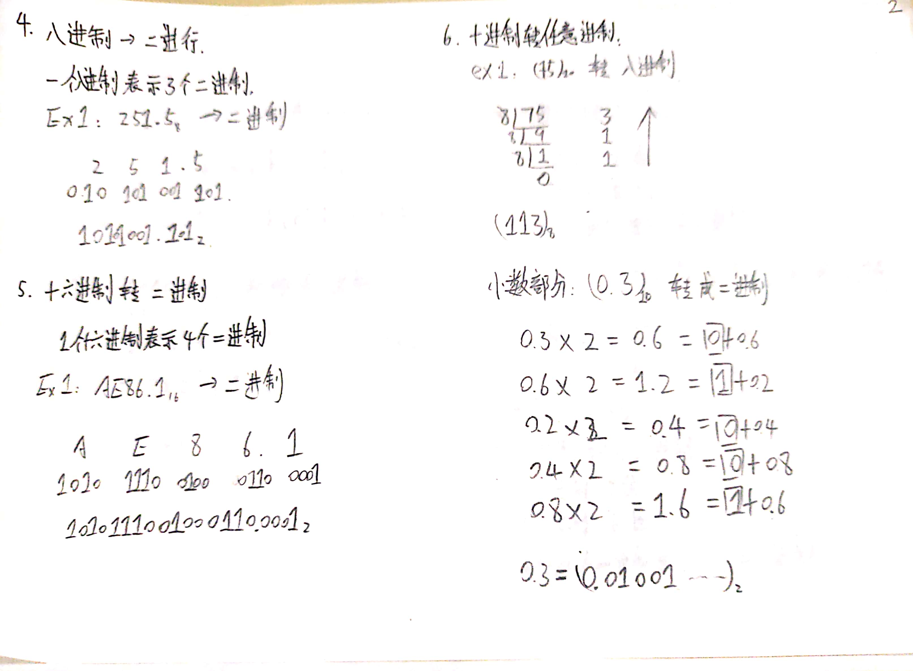

[[TOC]]

## Notation and Converting




## Data Sizes


## Addressing and Byte Ordering


```c
#include <stdio.h>

typedef  unsigned char *byte_pointer;
void show_bytes(byte_pointer start, size_t len) {
  int i;
  for (i = 0; i < len; i++) {
    printf(" %.2x", start[i]);
  }
  printf("\n");
}

void show_int(int x) {
  show_bytes((byte_pointer) &x, sizeof(int));
}

void show_float(int x) {
  show_bytes((byte_pointer) &x, sizeof(float));
}

void show_pointer(void *x) {
  show_bytes((byte_pointer) &x, sizeof(void *));
}

void test_show_bytes(int val) {
  int ival = val;
  float fval = (float) val;
  int *pval = &val;

  show_int(ival);
  show_float(fval);
  show_pointer(pval);
}

int main() {
  test_show_bytes(0X123456);
  return 0;
}

/**
 * 56 34 12 00
 * 56 34 12 00
 * 00 fe 61 00 00 00 00 00
 */
```

从上面输出结果来看，该机器数据存储方式为小端(little endian)存储。

## Representing Strings

### BCD 码


## Representing Code

book

## Introduction to Boolean Algebra


| sign |         name         |                 case                 |
| :--: | :------------------: | :----------------------------------: |
|  &   |     intersection     | 01000001, {0, 6}(from right to left) |
|  \|  |        union         |       01111101, {0,2 3, 4,5,6}       |
|  ^   | symmetric difference |        00111100, {2,3,4,5,6}         |
|  ~   |      complement      |         10101010, {1,3,5,7}          |

## Bit-Level Operations in C


```c
#include <stdio.h>

void inplace_swap(int *x, int *y) {
  *y = *x ^ *y; /* step 1*/
  *x = *x ^ *y; /* step 2*/
  *y = *x ^ *y; /* step 3*/
}

void test_inplace_swap() {
  int a = 10;
  int b = 20;
  printf("origin: a = %d, b = %d\n", a, b);
  inplace_swap(&a, &b);
  printf("swapped: a = %d, b = %d\n", a, b);

}

int main() {
  test_inplace_swap();
  return 0;
}
```

通过位运算实现原地交换两个整数。对于 `^` 有如下特性：

1. `a ^ a = 0`
2. `a ^ b ^ a = b`

|     step      | \*x |  \*y  |
| :-----------: | :-: | :---: |
| initial value |  a  |   b   |
|     step1     |  a  | a ^ b |
|     step2     |  b  | a ^ b |
|     step3     |  b  |   a   |

## Logical Operations in C

## Shift Operations in C

book

## Summary

### Notation and Converting

1. 计算机表示数据
2. 进制的转换
   - 任意进制 -> 十进制
   - 二进制 -> 八进制
   - 八进制 -> 二进制
   - 十六进制 -> 二进制
   - 十进制 -> 任意进制

### Addressing and Byte Ordering

1. big endian
2. little endian

### Representing Strings

1. 字符的表示
   - 英文字符
   - 中文字符
2. BCD
   - 8421 码
   - 余 3 码
   - 2421 码
3. 检错与纠错
   - 奇偶效验。单组模运算。
   - 海明效验。分组模运算。
   - CRC 循环冗余码。被除数 / 除数 = 商 $\cdots \cdots$ 余数。

### Boolean Algebra

1. &
2. |
3. ~
4. ^

## Appendix

### Practices

#### Addressing and Byte Ordering


|     | Little endian | Big endian |
| :-: | :-----------: | :--------: |
|  A  |      78       |     12     |
|  B  |    78, 56     |   12, 34   |
|  C  |  78, 56, 34   | 12, 34, 56 |

### Representing Strings


"mnopqr": 6d 6e 6f 70 71 72 \0.
但是，`strlen(str)`不会计算\0，所以打印`6d6e6f707172`。
