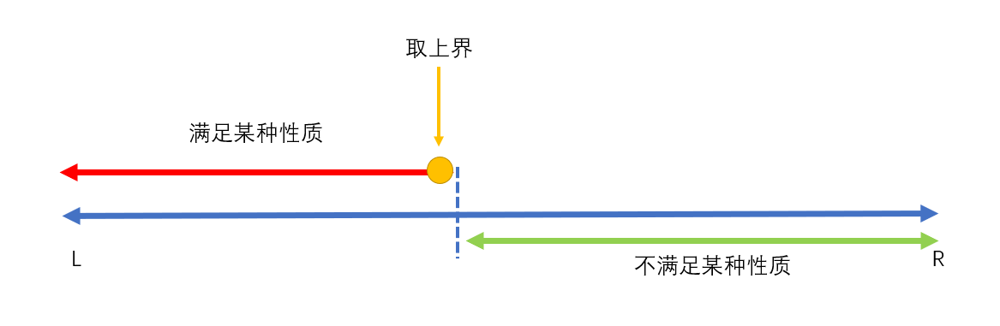
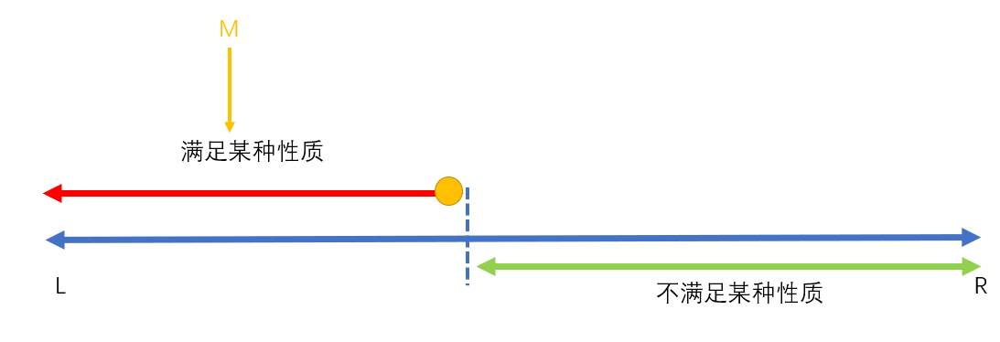
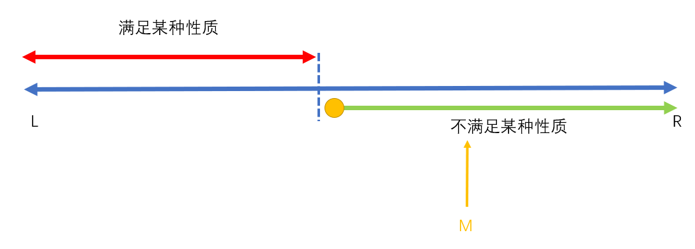
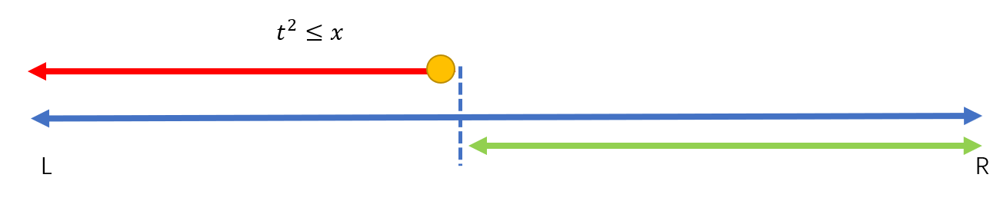

符号表：

|      符号       |      含义      |
| :-------------: | :------------: |
|        L        |   区间左端点   |
|        R        |   区间右端点   |
|        M        |    区间中点    |
|   (L + R) / 2   | 区间中点取下界 |
| (L + R + 1) / 2 | 区间中点取上界 |
|    `[L, R]`     |  左闭右闭区间  |
|    `check()`    |    检验函数    |

## 二分模板及其使用

二分的使用场景：能将数据划分为两类：

- 左边：满足某种性质（用红颜色表示）。
- 右边：不满足某种性质（用绿颜色表示）。

<div style="text-align: center;" class="awesome-img"></div>

我们把性质划分函数记为 `check()`，则根据实际可以有如下两种情况：

1. 取满足某种性质的上界。
2. 取不满足某种性质的下界。

（其他情况可以通过设置 `check()` 函数来实现。）

<div style="text-align: center;" class="awesome-img"></div>
<div style="text-align: center;" >情况一：取上界</div>

<div style="text-align: center;" class="awesome-img"></div>

<div style="text-align: center;">情况二：取下界</div>

---

对于情况一（找满足条件的上界，`check()` 指向红色部分），可以做如下分析：

<div style="text-align: center;" class="awesome-img"></div>

- `if (check())`，我们要找的点在 M 的右边，且 M 为满足要求的点，则区间变化为 `[L, R] -> [M, R]`
- `else`，我们要找的点在 M 的左边，且 M 为不满足要求的点，则区间变化为 `[L, R] -> [L, M - 1]`

对应模板（伪代码）为：

```typescript
declare function check(...args: any[]): boolean
function binary(l: number, r: number) {
  while (l < r) {
    const mid = (l + r) >>> 1
    if (check(mid)) l = mid
    else r = mid - 1
  }
  return l
}
```

对于情况二（找满足条件的下界，`check()` 指向绿色部分），可以做如下分析：

<div style="text-align: center;" class="awesome-img"></div>

- `if (check())`，我们要找的点在 M 的左边，且 M 为满足要求的点，则区间变化为 `[L, R] -> [L, M]`
- `else`，我们要找的点在 M 的右边，且 M 为不满足要求的点，则区间变化为 `[L, R] -> [M + 1, R]`

对应模板（伪代码）为：

```typescript
declare function check(...args: any[]): boolean
function binary(l: number, r: number) {
  while (l < r) {
    const mid = (l + r) >>> 1
    if (check(mid)) r = mid
    else l = mid + 1
  }
  return l
}
```

**注意事项：** `M` 在两种情况下的计算过程不一样。

- 在取上界的时候，我们采用 `mid = (l + r + 1) >>> 1`。
- 在取下界的时候，我们采用 `mid = (l + r) >>> 1`。

## 练习

### 二分查找

在数组中找 `target` 的索引，找到返回对应的索引，找不到返回 -1。

```typescript
// 取上界方式
function binaryUpper(arr, target, l, r) {
  while (l < r) {
    const mid = (l + r + 1) >>> 1
    if (arr[mid] <= target) {
      l = mid
    } else {
      r = mid - 1
    }
  }

  return arr[l] === target ? l : -1
}
// 取下界方式
function binaryLower(arr, target, l, r) {
  while (l < r) {
    const mid = (l + r) >>> 1
    if (arr[mid] >= target) {
      r = mid
    } else {
      l = mid + 1
    }
  }
  return arr[l] === target ? l : -1
}
```

## 解题思路

1. 确定区间。
2. 使用代码框架。
3. 确定 `check` 函数。
4. 确定更新方式（上界 / 下界）。

下面以 LeetCode [69. Sqrt(x)](https://leetcode-cn.com/problems/sqrtx/) 为例，对模板的使用：

题目要求是实现一个 `sqrt` 然后要下取整，下面开始上述的步骤：

1. 确定区间。显然题目的区间是 `[0, x]`。
2. 代码框架。
   ```cpp
   class Solution {
   public:
    int mySqrt(int x) {
      int l = 0;
      int r = x;
      while (l < r) {
        int mid = (l + r + ?) >> 1;  // ? = 0 / 1
      }
      return l;
    }
   };
   ```
3. 确定 `check` 函数。我们可以将区间 `[0, x]` 进行划分，左边红颜色的为 $[l, t^2 \le \lfloor x \rfloor]$，右边绿颜色的为 $[\lfloor x \rfloor + 1, r]$
<div style="text-align: center;" class="awesome-img"></div>

4. 确定更新方式。经过上述的分析，我们要的是红色的上界，所以 `mid = l + r + 1`。

下面是完整的代码：

```cpp
class Solution {
public:
    int mySqrt(int x) {
      int l = 0;
      int r = x;
      while (l < r) {
        // 当 r = MAX_INT 的时候会发生上溢。
        int mid = (l + (long long)r + 1) >> 1;
        // 相当于 mid * mid < x，但这样可以避免上溢。
        if (mid <= x / mid) l = mid;
        else r = mid - 1;
      }
      return l;
    }
};
```

## References

- [常用代码模板 1——基础算法](https://www.acwing.com/blog/content/277/)

- [LeetCode 暑期刷题打卡 2019——Week1 二分专题](https://www.bilibili.com/video/BV1Ft41157zW?spm_id_from=333.999.0.0)
