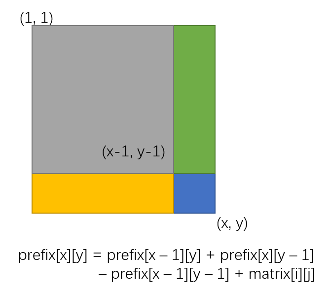

## 前缀和

计算数组前 i 个数的和作为查询数组。
则数组中 arr[i, ...j] 个数的和为 prefix[j] - prefix[i - 1]

```cpp
#include <iostream>
#include <cstdio>
#include <string>
#include <vector>
#include <algorithm>
using namespace std;

const int N = 1e6 + 10;
int arr[N], prefix[N];

int main() {
  int n, q;
  cin >> n >> q;
  for (int i = 1; i <= n; i++) cin >> arr[i];
  for (int i = 1; i <= n; i++) prefix[i] = prefix[i - 1] + arr[i];

  while (q--) {
    int l, r;
    cin >> l >> r;
    cout << prefix[r] - prefix[l - 1] << endl;
  }
  return 0;
}
```

## 子矩阵的前缀和

1. 计算前缀和。
   <div style="text-align: center;" class="awesome-img"></div>

2. 计算子矩阵的前缀和。

   <div style="text-align: center;" class="awesome-img"></div>

```cpp
#include <iostream>
#include <cstdio>
#include <string>
#include <vector>
#include <algorithm>
using namespace std;
const int N = 1010;
int matrix[N][N];
int prefix[N][N];

int main() {
  int n, m, q;
  cin >> n >> m >> q;
  for (int i = 1; i <= n; i++) {
    for (int j = 1; j <= m; j++) {
      cin >> matrix[i][j];
    }
  }

  for (int i = 1; i <= n; i++) {
    for (int j = 1; j <= m; j++) {
      prefix[i][j] = prefix[i - 1][j] + prefix[i][j - 1] - prefix[i - 1][j - 1] + matrix[i][j];
    }
  }

  while (q--) {
    int x1, y1, x2, y2;
    cin >> x1 >> y1 >> x2 >> y2;
    cout << prefix[x2][y2] - prefix[x1 - 1][y2] - prefix[x2][y1 - 1] + prefix[x1 - 1][y1 - 1] << endl;
  }
  return 0;
}
```
