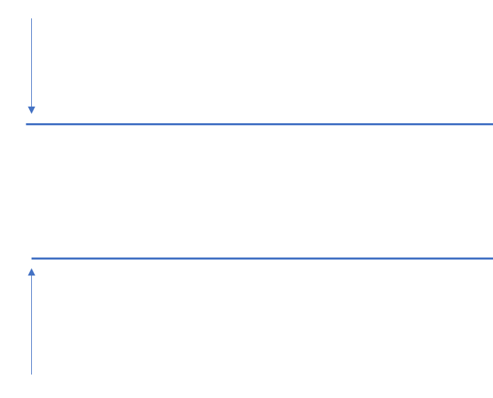
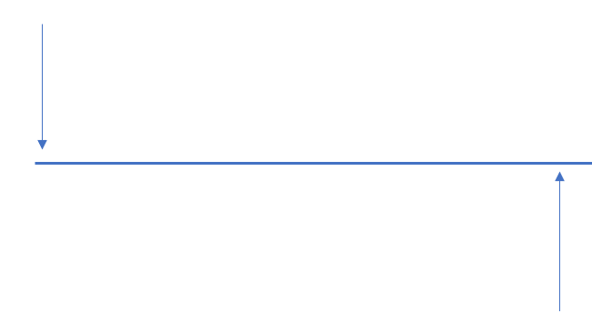

## 双指针算法的分类

常见的双指针算法可以分为如下两类：

1. 双指针指向头部：
   <div style="text-align: center;" class="awesome-img"></div>
2. 一个指向队头，一个指向队尾：
   <div style="text-align: center;" class="awesome-img"></div>

### 类别一

考虑下面的情况：

```cpp
for (int i = 0; i < n; i++) {
  for (int j = 0; j < n; j++) {
    if (check(i, j)) {
      // ...
    }
  }
}
```

这是一个很朴素的双重循环遍历算法，算法的复杂度为 $o(n^2)$。
但是，对于单调序列而言，这种算法可以进一步优化，由于序列具有单调性，
我们可以在 $o(n)$ 的复杂度下就能完成。所以可以优化为如下的代码：

```cpp
for (int i = 0; i < n; i++) {
  for (int j = 0; j <= i; j++) {
    if (check(i, j)) j++;
  }
}
```

最终 i 指针走了 n 步，j 指针也走了 n 步，而且各自独立。所以算法的复杂度为 $o(n)$。

### 例题分析

[799. 最长连续不重复子序列.](https://www.acwing.com/problem/content/801/)

如果采用暴力的方式，可以有如下的代码：

```cpp
int res = 0;

for (int i = 0; i < n; i++) {
  for (int j = 0; j <= i; j++) {
    if (check(i, j)) {
      res = max(res, i - j + 1);
    }
  }
}
```

对于这道题，我们可以规定：

- i 指向右边的索引，可以不断向前移动。
- j 指向**最左边**的索引，使得在 $[j, i]$ 这个区间内没有重复的数字。

有了这样的规定，我们可以得出如下的结论：当 i 往前移动一步的时候（i++），
j 要么停留在原地，要么向前移动。证明如下：

1. 当 `arr[++i]` 没有在 `[j, i - 1]` 的区间，条件满足。
2. 当 `arr[++i]` 在 `[j, i - 1]` 的区间，j++。如果此时 j 向左边移动的话（假设只移动了一步），此时区间为 [j - 1 , i - 1]。显然，该区间被放大了。我们规定了 j 是**最左边**不含重复重复元素的索引，显然 j - 1 与规定矛盾。

具体的题解：

```cpp
#include <iostream>
#include <cstdio>
#include <string>
#include <vector>
#include <algorithm>
using namespace std;

const int N = 1e6 + 10;
int arr[N], s[N]; // s[i] 表示整数 i 出现的次数

int main() {
  int n = 0;
  cin >> n;
  for (int i = 0; i < n; i++) cin >> arr[i];
  int res = 0;

  for (int i = 0, j = 0; i < n; i++) {
    s[arr[i]]++;  // arr[i] 表示当前的数字，s[arr[i]]++ 表示当前数字出现次数 + 1

    while (s[arr[i]] > 1) { // 当前数字出现两次，说明有在区间 [i, j] 有重复的数字出现
      // 边移动 j 指针，边减少计数
      s[arr[j]]--;
      j++;
    }
    res = max(res, i - j + 1);
  }

  cout << res << endl;
  return 0;
}
```
