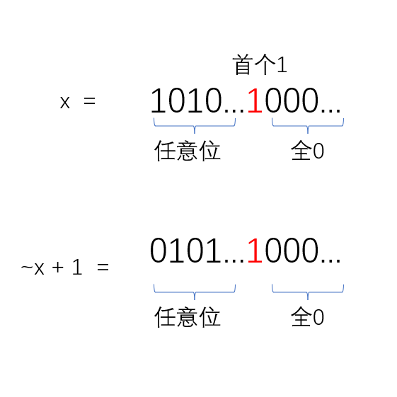

## 示例

输入一个整数 x，输出该整数 1 最低位的位置低位补 0。

例如：

```
输入：
10 (1010b)
输出：
2 (10b)

输入：100 (1100100b)
输出：4 (100b)

输入：20 (10100b)
输出：4 (100b)
```

## code

```cpp
int lowBit(int x) { return x & -x; }
```

## 说明

在 cpp 里面，-x 等价于取反加一。即：$-x = ~x + 1$。

考虑下面的情况：当 x = 20d 时，x = 10100b。

则 $~x + 1 = 01100$。所以 $ x & - x = 100b$

对于更一般的情况：

<div style="text-align: center;" class="awesome-img"></div>

可以看到，$~x + 1$ 后，最低位 1 前面的位数是相反的关系，所以采用与运算就可以得到我们要的结果。

## 例题

[801. 二进制中 1 的个数](https://www.acwing.com/problem/content/803/)

既然我们知道如何去求 x 最低位的 1 所代表的数，那么我们只需要用 x = x - (x & -x);
每减一次，x 最低位的 1 将会被置为 0，我们只需要统计一下做减法的次数即可。

```cpp
#include <iostream>
#include <cstdio>
#include <string>
#include <vector>
#include <algorithm>
using namespace std;

int main() {
  int n, x;
  cin >> n;
  while (n--) {
    int res = 0;
    cin >> x;
    while (x != 0) {
      x -= x & -x;
      ++res;
    }
    cout << res << " ";
  }
  return 0;
}
```
