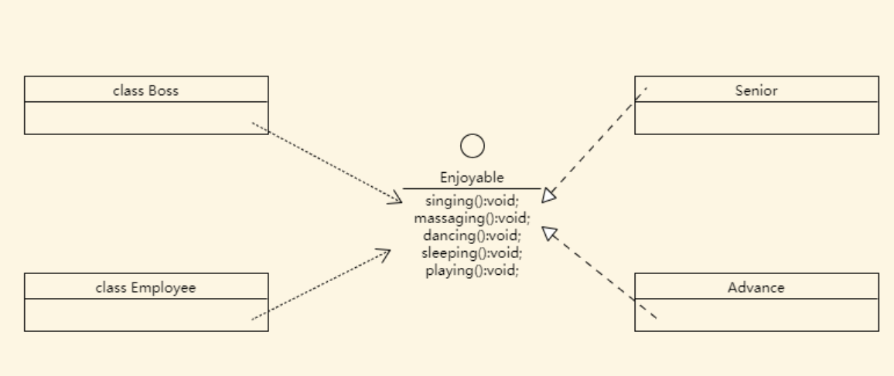
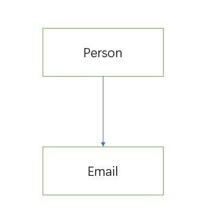
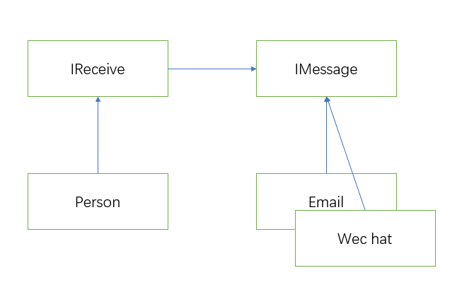

设计模式的七大设计原则：

1. 单一职责原则
2. 接口隔离原则
3. 依赖倒置原则
4. 里氏替换原则
5. 开放封闭原则（OCP）
6. 迪米特法则
7. 合成复用原则

## 单一职责原则

> 单一职责原则要求：对于类而言，单一职责要求一个类只负责一项职责。
> 如果类 A 负责两个不同的职责，如：职责 1 和职责 2。
> 当职责 1 需求改变时改变类 A，可能会造成职责 2 执行错误，
> 这种情况下就违法了单一职责原则。
> 所以我们需要把类 A 的分解为 A1， A2，分别负责不同的职责。

对于函数也类似。

### introduction

上面的说法可能有些抽象，让我们从具体的例子中体验一下这一原则。

需求：

1. 我们使用不同的交通工具出行。
2. 需要有时间限制。

### implementation

#### tradition

我们先来实现第一个功能：

```typescript
class Vehicle {
  public type: string

  constructor(type: string) {
    this.type = type
  }

  operate() {
    console.log(`${this.type} is running...`)
  }
}
```

从上面的例子上看，我们实现一个交通工具类 (`Vehicle`)，让
它执行一个 `operate` 方法，来现象出行。

接下来，我们来实现第二个功能：

```typescript
  operate(start: number, end: number) {
    const interval = end - start;
    const LIMIT = 20;
    if (interval <= LIMIT) {
      console.log(`${this.type} is running...`);
    } else {
      console.log(`Out of time...`);
    }
  }
```

下面就开启我们的出行之旅：

```typescript
function main() {
  const car = new Vehicle('car')
  const train = new Vehicle('train')
  const plane = new Vehicle('plane')

  car.operate(0, 10)
  train.operate(0, 10)
  plane.operate(0, 10)
}

main()
```

从实现上面看，汽车 (car) 和火车 (train) 会跑，这显然没有问题。
但是，飞机 (plane) 也会跑这显然就离谱了。
其次就是每次我们修改 `LIMIT`，对所有的出行工具都有影响。
但是，我们想对不同的工具进行不同的时间限制，如果从
上面的代码进行修改，我们得使用到很多的 `if else` 判断
才能实现。

显然，我们这样的设计是有缺陷的，也就是违反了**单一设计原则**。

#### design pattern

接下来，我们使用更好的设计（只是单纯演示，并没有使用具体的
设计模式），来实现上面的功能。

首先，我们通过类层面实现：

```typescript
abstract class Vehicle {
  public type: string

  constructor(type: string) {
    this.type = type
  }

  abstract operate(start: number, end: number): void
}

class RunnableVehicle extends Vehicle {
  operate(start: number, end: number): void {
    const interval = end - start
    if (interval <= 20) {
      console.log(`${this.type} is running...`)
    } else {
      console.log(`out of time...`)
    }
  }
}

class SwimmableVehicle extends Vehicle {
  operate(start: number, end: number): void {
    const interval = end - start
    if (interval <= 20) {
      console.log(`${this.type} is swimming...`)
    } else {
      console.log(`out of time...`)
    }
  }
}

class FlyableVehicle extends Vehicle {
  operate(start: number, end: number): void {
    const interval = end - start
    if (interval <= 20) {
      console.log(`${this.type} is flying...`)
    } else {
      console.log(`out of time...`)
    }
  }
}
```

我们将 `Vehicle` 类进行抽象，同时创建三个具体的类。
每个类只负责单一的职责。通过这样的修改后，我们再去
修改时间限制就不会影响到其他类了。

接下来我们再从方法层面实现：

```typescript
class Vehicle {
  public type: string

  constructor(type: string) {
    this.type = type
  }

  run(start: number, end: number) {
    const interval = end - start
    if (interval <= 20) {
      console.log(`${this.type} is running...`)
    } else {
      console.log(`out of time...`)
    }
  }

  fly(start: number, end: number) {
    const interval = end - start
    if (interval <= 20) {
      console.log(`${this.type} is flying...`)
    } else {
      console.log(`out of time...`)
    }
  }

  swim(start: number, end: number) {
    const interval = end - start
    if (interval <= 20) {
      console.log(`${this.type} is swimming...`)
    } else {
      console.log(`out of time...`)
    }
  }
}
```

#### comparison

通过比较上面两种实现方式，我们可以更好地理解
单一职责原则。利用这一原则，有利于我们后续对
代码的修改和维护。

### precautions

单一职责原则要求我们：

1. 降低类的复杂度，一个类只负责一项职责。
2. 提高类的可读性、可维护性。
3. 降低变化而引起的风险。
4. 通常情况下，我们应当遵守单一职责原则。只有当
   逻辑组够简单的时候，才可以在代码级违反单一职责原则。
   只有类中方法数量组够少，才可以在方法层面上保持
   单一职责原则。

## 接口隔离原则

> 接口隔离原则要求：客户端不应该依赖它不需要的接口。即，
> 一个类对另一个类的依赖应该建立在**最小**接口上的。

要讲清楚其中的利弊，还是让我们通过一个简单的例子说明。

### introduction



现在我们有一个 `Enjoyable` 接口。分别有两种实现方式 `Senior` 和 `Advance`。

我们的 `Boss` 通过 `Enjoyable` 接口，依赖了 `Advance` 中的 `dancing`, `massaging`, `sleeping` 三个方法。

我们的 `Employee` 通过 `Enjoyable` 接口，依赖了 `Senior` 中的 `playing`, `sleeping`, `singing` 方法。

### implementation

#### tradition

```typescript
interface Enjoyable {
  singing(): void
  massaging(): void
  dancing(): void
  sleeping(): void
  playing(): void
}

class Advance implements Enjoyable {
  singing(): void {
    console.log(`Advanced singing...`)
  }
  massaging(): void {
    console.log(`Advanced massaging...`)
  }
  dancing(): void {
    console.log(`Advanced dancing...`)
  }

  sleeping(): void {
    console.log(`Advanced sleeping...`)
  }
  playing(): void {
    console.log(`Advanced playing...`)
  }
}

class Senior implements Enjoyable {
  singing(): void {
    console.log(`Senior singing...`)
  }
  massaging(): void {
    console.log(`Senior massaging...`)
  }
  dancing(): void {
    console.log(`Senior dancing...`)
  }

  sleeping(): void {
    console.log(`Senior sleeping...`)
  }
  playing(): void {
    console.log(`Senior playing...`)
  }
}

class Boss {
  enjoy(activities: Enjoyable) {
    activities.dancing()
    activities.massaging()
    activities.sleeping()
  }
}

class Employee {
  enjoy(activities: Enjoyable) {
    activities.playing()
    activities.sleeping()
    activities.singing()
  }
}
```

上面的实现方式存在一个问题。就是 `Boss` 和 `Employee` 依赖了多余的方法。
对于 `Boss` 来讲，`Enjoyable` 中的 `playing` 和 `singing` 是用不到的。
对于 `Employee` 来讲，`Enjoyable` 中的 `massaging` 和 `dancing` 是用不到的。

这种实现方式违反了接口隔离原则。正确的做法是讲 `Enjoyable` 接口分割成几个接口，
然后让实现类按需实现接口。

#### design pattern

为了解决上面的问题，我们需要将 `Enjoyable` 这个范围太大的接口拆分成若干个小的接口。
然后提取公共部分，对于不相同的部分，我们逐个实现。

```typescript
interface CommonEnjoyable {
  sleeping(): void
}

interface AdvancedEnjoyable extends CommonEnjoyable {
  massaging(): void
  dancing(): void
}

interface SeniorEnjoyable extends CommonEnjoyable {
  playing(): void
  singing(): void
}
```

剩下的操作就是将代码中冗余的部分删除即可。

### comparison

两种实现方式进行比较我们可以得出，使用接口隔离的方式我们可以
明确各部分代码的职责，可以避免在实现类中存在冗余的代码。

## 依赖倒置原则

在软件编程中，低层模块尽量要依赖抽象类或者接口，才能使程序稳定性更好。
这样做我们的变量引用和实际对象间，就存在一个缓存层，便于后续的拓展和优化。

### 示例

```typescript
class Email {
  getMessage() {
    return 'hello person'
  }
}

class Person {
  receive(email: Email) {
    console.log('receive message: ', email.getMessage())
  }
}
```



从上面的例子我们可以看到，`Person` 直接依赖 `Email`，这样一来，
如果我们想要接收的不是 `Email` 信息。那么，我们还需要修改这两个类的
代码。

我们再将上面的代码采用 依赖倒置的原则进行实现：

```typescript
interface IReceive {
  getMessage(message: Message): void
}

interface IMessage {
  getMessage(): string
}

class Person implements IReceive {
  getMessage(message: IMessage): void {
    console.log('receive message: ', message.getMessage())
  }
}

class Email implements IMessage {
  getMessage(): string {
    return 'email message'
  }
}

class WeiChat implements IMessage {
  getMessage(): string {
    return 'wechat message'
  }
}
```

我们创建两个接口 `IReceive` 和 `IMessage` 对原先的具体类
进行抽象，具体类实现抽象类，从而将依赖分离。
那么为什么这个原则称之为**依赖倒置原则**呢？
来看我们实现后的类图：



可以看到上层类 `Person` 对于下层类 `Email` 和 `Wechat` 的依赖呈现倒置
的情况。这样做的好处在于
**我们对于上层类和下层类都有很好的扩展性**，而且修改其中一部分的代码不会直接
影响到另一个类的实现。

### 实现依赖倒置的方式

实现依赖倒置有三种方式：

1. 使用接口代替具体类。
   上面的例子就是基于这个方式实现的。
2. 构造器方式实现。
3. `setter` 实现。

```typescript
// 构造函数实现。
interface IReceiver {
  receive(): void
}

interface IMessage {
  getMessage(): string
}

class Person implements IReceiver {
  constructor(private message: IMessage) {}

  receive(): void {
    console.log('receive message: ', this.message.getMessage())
  }
}
```

```typescript
interface IReceiver {
  setMessage(message: IMessage): void
  receive(): void
}

interface IMessage {
  getMessage(): string
}

class Person implements IReceiver {
  private message!: IMessage
  setMessage(message: IMessage): void {
    this.message = message
  }

  receive(): void {
    if (!this.message) return
    console.log('receive message: ', this.message.getMessage())
  }
}
```

和使用构造函数类似，我们为具体类内部提供一个属性 `message`，
然后使用一个 `setMessage` 利用接口设置 `message`。

**值得注意的是**，我们在使用 `message` 之前需要确保 `message` 存在，
不然会出现一个引用错误。

## 里氏替换原则

 <!-- todo(rushui 2021-07-03): 完成里氏替换原则 -->

使用组合和聚合代替继承。

## 开放封闭原则（OCP）

开闭原则是编程中最基础、最重要的设计原则。

开闭原则要求软件实体类，**模块和函数应该对扩展开放（对接口的提供方），对修改关闭（对使用一方）**。用抽象构建框架，用实现拓展内容。

当软件需求发生变化的时候，尽量通过拓展软件实体类的行为来实现，而不是修改原有的代码。

在软件编程中，使用设计模式的最终目的就是为了实现开闭原则。

### 示例

在使用开闭原则之前，让我们来看一个错误的示范：

```typescript
enum ShapeType {
  circle,
  triangle,
  rectangle,
}

abstract class Shape {
  // constructor(protected type: ShapeType) {}
  protected _type!: ShapeType

  get type() {
    return this._type
  }
}

class Triangle extends Shape {
  constructor() {
    super()
    this._type = ShapeType.triangle
  }
}

class Rectangle extends Shape {
  constructor() {
    super()
    this._type = ShapeType.triangle
  }
}

class Circle extends Shape {
  constructor() {
    super()
    this._type = ShapeType.circle
  }
}

class Graph {
  constructor(private shape: Shape) {}

  draw() {
    const type = this.shape.type
    if (type === ShapeType.circle) {
      this.drawCircle()
    } else if (type === ShapeType.rectangle) {
      this.drawRectangle()
    } else if (type === ShapeType.triangle) {
      this.drawTriangle()
    }
  }

  drawCircle() {
    console.log('drawing a circle...')
  }
  drawTriangle() {
    console.log('drawing a triangle...')
  }
  drawRectangle() {
    console.log('drawing a rectangle...')
  }
}
```

在上面的代码中，提供者为 `Shape`，而使用者为 `Graph`。但是
我们并没有对 `Graph` 修改封闭，这是为什么呢？

例如：我们现在想增加一个 `Square` 的 `Shape` 实现类，
这时候我们就需要修改 `Graph` 中的代码，以便让其支持我们
新增的 `Square`，这样做的后果就是我们需要在 `Graph` 中
添加一个分支语句，同时添加一个 `drawSquare` 的方法，这就
违反了开闭原则。

下面我们就使用抽象来修改我们上面的代码：

```typescript
abstract class Shape {
  // constructor(protected type: ShapeType) {}
  protected _type!: ShapeType
  get type() {
    return this._type
  }
  abstract draw(): void
}

class Circle extends Shape {
  constructor() {
    super()
    this._type = ShapeType.circle
  }

  draw(): void {
    console.log('drawing a circle...')
  }
}
class Rectangle extends Shape {
  constructor() {
    super()
    this._type = ShapeType.rectangle
  }

  draw(): void {
    console.log('drawing a rectangle...')
  }
}

class Triangle extends Shape {
  constructor() {
    super()
    this._type = ShapeType.triangle
  }

  draw(): void {
    console.log('drawing a triangle...')
  }
}

class Graph {
  constructor(private shape: Shape) {}
  draw(): void {
    this.shape.draw()
  }
}
```

我们在 `Shape` 中添加一个抽象的方法 `draw` 提供不同类型的子类
绘制方法。自己在继承 `Shape` 后定制化 `draw` 方法就能实现不同的
绘制方法。

这样一来，我们在 `Graph` 的 `draw` 中，只需要调用 `shape` 的 `draw`
方法即可。通过的实现方式，我们可以看到代码中的分支语句被删除了，
同时，如果我们有新的类型需要增加的化，我们不用再修改 `Graph` 中的代码，
也就是说**对于使用一方实现了修改关闭**，同时对于提供一方（`Shape`）
实现了扩展开放。

## 迪米特法则

Dimeter 要求：**一个对象应该对其他对象保持最少的了解。**

迪米特法则又称最少知道原则，即一个类对自己依赖的类知道得越少越好(只知道公开的接口)。
也就是说，对于被依赖的类，不管有多么复杂，都尽量将逻辑封装在类的内部，对外除了提供
`public` 方法，只与**直接朋友**通信。

类与类之间的耦合方式有很多种：依赖，关联，组合，聚合等。其中，我们称**出现在成员变量，方法参数，方法返回值的类为直接朋友**。
而出现在**局部变量**的类不是直接朋友。迪米特法则就是要求我们对于非直接朋友的类不要以局部变量的形式出现在类的内部，不然这样的耦合性会很高。

```typescript
class A {}

class B {
  // 直接朋友。
  private friend: A
  m(friend: A): void {}
  m2(): A {}

  // 非直接朋友。
  m3() {
    let a: A // 陌生类以局部变量的方式出现。
  }
}
```

### 示例

我们用两个 `Manager` 类来分别管理学校总部的员工 `SchoolEmployee` 和
下属学校的员工 `SubSchoolEmployee` 。
然后学校 `SchoolManager` 中展示学校所有的员工（包括学校总部和下属学校的员工）。

错误示范：

```typescript
/**
 * 学校总部员工。
 */
class SchoolEmployee {
  constructor(private id: number) {}
  getId() {
    return this.id
  }
  setId(id: number) {
    this.id = id
  }

  toString() {
    return `学校员工${this.id}`
  }
}

/**
 * 下属学校员工。
 */
class SubSchoolEmployee {
  constructor(private id: number) {}
  getId() {
    return this.id
  }
  setId(id: number) {
    this.id = id
  }
  toString() {
    return `下属学校员工${this.id}`
  }
}

/**
 * 下属学校管理。
 */
class SubSchoolManager {
  private employees: SubSchoolEmployee[] = []
  constructor() {
    for (let i = 0; i < 5; i++) {
      this.employees.push(new SubSchoolEmployee(i))
    }
  }
  getEmployees() {
    return this.employees
  }
}

class SchoolManager {
  private employees: SchoolEmployee[] = []
  constructor() {
    for (let i = 0; i < 10; i++) {
      this.employees.push(new SchoolEmployee(i))
    }
  }

  /**
   * 获取学校总部员工。
   */
  getEmployees() {
    return this.employees
  }

  /**
   * 展示所有的员工信息，包括学校总部和下属学校的员工信息。
   */
  showAllEmployees() {
    const subSchoolManager = new SubSchoolManager()
    console.log('学校总部员工：', this.getEmployees().toString())
    console.log('下属学校员工：', subSchoolManager.getEmployees().toString())
  }
}
```

上面代码中，属于 `SchoolManager` 的直接朋友有 `SchoolEmployee`。
属于非直接朋友有 `SubSchoolManager`。由于间接朋友的存在，类与类之间的耦合度
大大提高了，一旦 `SubSchoolManager` 中对于 `getEmployees` 的实现发生变化，
我们还得修改 `SchoolManager` 中的代码，这也违背了 OCP 原则。

为了降低代码的耦合度，我们应该尽量避免在类中使用非直接朋友。
所以，我们可以做如下改进：
将 `SchoolManager` 中对于 `SubSchoolManager` 的依赖改用方法参数的方式传入，
同时，将获取展示下属学校员工的方法由具体的 `SubSchoolManager` 去实现。

```typescript
/**
 * 下属学校管理。
 */
class SubSchoolManager {
  // ...

  showEmployees() {
    console.log('下属学校员工：', this.employees.toString())
  }
}

class SchoolManager {
  // ...
  showAllEmployees(subSchoolManager: SubSchoolManager) {
    console.log('学校总部员工：', this.getEmployees().toString())
    subSchoolManager.showEmployees()
  }
}
```

### 注意事项和细节

迪米特法则的核心是降低类之间的耦合度。
但是，由于每个类都减少了不必要的依赖，因此，迪米特法则知识要求降低类与类直接按的耦合关系，
并不是要求彼此完全没有耦合。

## 合成复用原则

尽量使用合成/聚合的方式，而不是直接使用继承。
