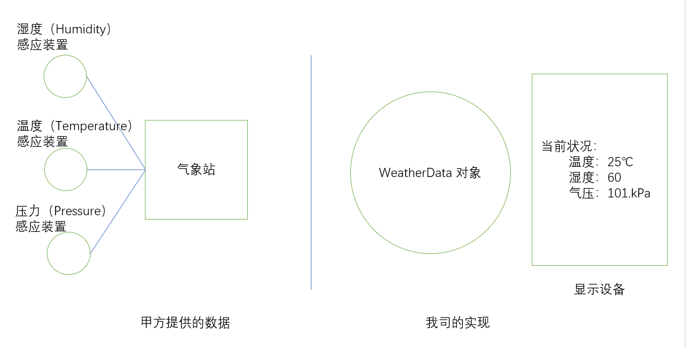
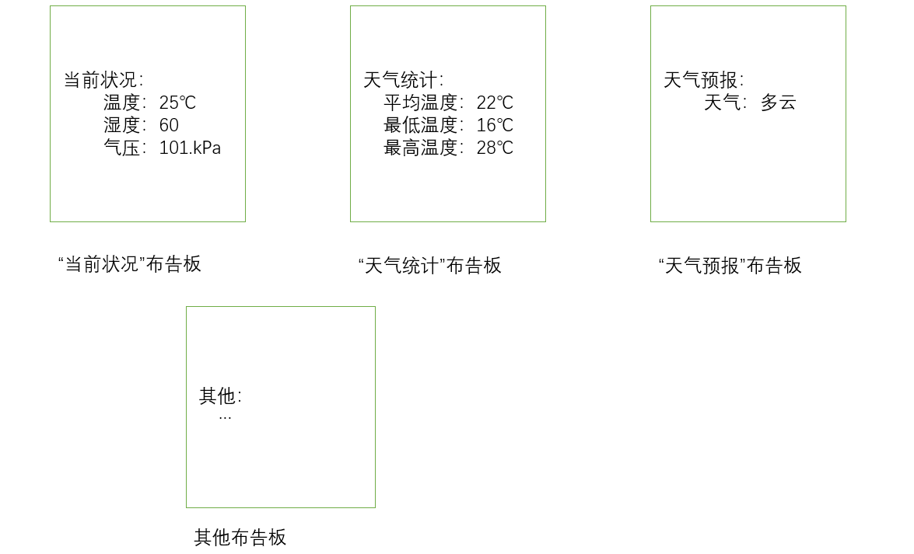
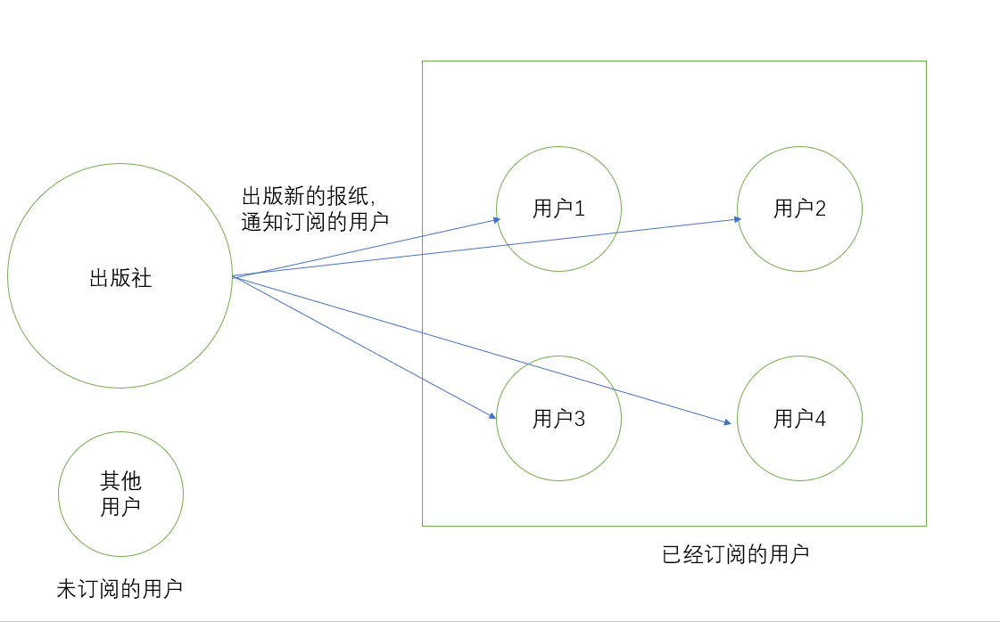
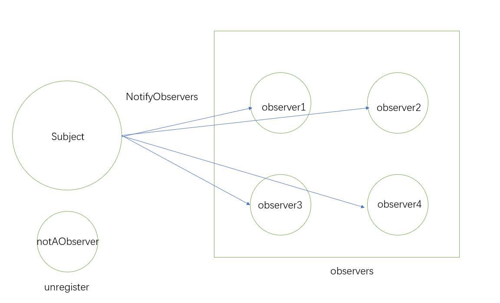
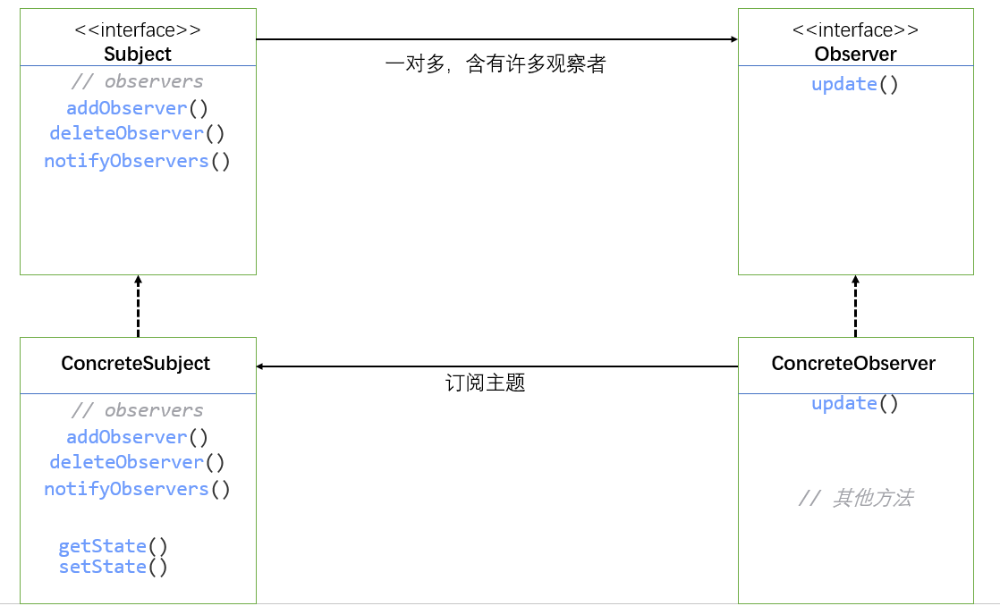

<center></center>
（本文是基于《Head First 设计模式》观察者模式的学习笔记）

## 引例：设计天气站

我司最近接到一笔订单，要求我们在 `WeatherData` 对象上建立一个应用。要求如下：
该应用需要有三种布告板，分别显示当前的状况（`currentConditions`），气象统计（`statistics`）以及简单的预报（`forecast`），而且**必须是实时更新**的。

此外，这得是一个**可扩张**的气象站，甲方希望公布一组 API，好让其他开发人员可以写出自己的气象布告板，并插入到此应用中。希望我司能够提供这样的 API。

<!-- 在动手之前，我们先来明确我们的任务： -->

<!-- 1. 设计一个 `WeatherData` 对象。 -->
<!-- 2. 提供 API。 -->
<!-- 3. 可扩展性。可扩展性体现在我们提供相应的 API，其他开发任用可以根据我们提供的 API 开发其他类型的应用（例如，开发一个未来过去统计布告板）。 -->



### 模板源文件

甲方在第二天提供了提供了模板源文件：

```typescript
class WeatherData {
  // 获取温度、湿度、压力。我们不需要知道具体的获取步骤
  // 只需要直接调用即可。
  getTemperature() {}
  getHumidity() {}
  getPressure() {}

  // 一旦气象测量发生变化，调用此方法。
  measurementChanged() {}
  // ...
}
```

我们的主要任务就是实现 `measurementChanged()`，好让它更新当前状况，气象统计，天气预报的显示布告板。

### 任务分析

1. `WeatherData` 类具有各种 `getter` 方法，可以得到三个测量值：温度、湿度和压力。
2. 当数据发生变化是，`measurementChanged()` 方法就会被调用。（这与 `vue` 很像）而且，我们不在乎该方法是如何被调用的，我们只在乎它被调用了。
3. 我们需要实现三个使用天气数据的布告板：“当前状况”布告板、“气象统计”布告板、“天气预报”布告板。一旦 `WeatherData` 数据发生变化，这些布告板立刻更新。
4. 该系统必须可以扩张。其他开发人员可以建立定制的布告板，用户可以随心所欲地添加或删除任何布告板。



### 错误示例

在开始动手之前，我们来看一个错误的示范：

```typescript
class WeatherData {
  // ...
  measurementChanged() {
    const temp = this.getTemperature()
    const humidity = this.getHumidity()
    const pressure = this.getPressure()

    // 更新布告板，后面会实现
    currentConditionsDisplay.update(temp, humidity, pressure)
    statisticsDisplay.update(temp, humidity, pressure)
    forecastDisplay.update(temp, humidity, pressure)
  }
}
```

潜在问题：

1. 高度耦合。<br />
   显然，我们在 `measurementChanged()` 中使用了 `xxxDisplay`。针对具体的实现编程，会导致我们以后在增加或删除布告板是，必须修改程序。
2. 缺乏封装性。<br />
   对于布告板，我们调用了其 `update` 方法，很明显，我们可以将其统一成一个接口，并且参数为`temp, humidity, pressure`。

为了解决该问题，我们可以使用观察者模式。

## 观察者模式

在讲观察者模式之前，来看生活中的一个例子——报纸和杂志的订阅。

1. 我们向某家报社订阅报纸。只要他们有新报纸出版，就会给我们送过来。只要我们还是他们的用户，他们就会不断地给我们送报纸。
2. 当我们不想再收到报纸的时候，我们可以取消订阅，报社将不会再送新的报纸过来。
3. 只要报社还在运行，就会有新的用户/单位向他们订阅报纸/取消订阅。



从上图中我们可以知道，当用户订阅了出版社的报纸时，每当出版社有新的报纸，就会通知（notifyObservers）订阅的用户。没有订阅的则不会收到出版社的通知。

事实上，观察者就是这样一个原理。如果我们把出版社改为“主题”（Subject），订阅者/用户改为“观察者”（Observer）。这就是我们的观察者模式。



从上面的图中我们可以知道，一个主题对应多个对象。也就是说观察者模式定义了一对多的关系。

### 定义

> **观察者模式**：定了了对象之间的**一对多**依赖。当一个对象的状态发生改变时，它的所有依赖者都会收到通知并且更新。

### 模型

在观察者模式中，主题（Subject）可以添加观察者（addObserver），删除观察者（deleteObserver），通知（发布消息）所有的观察者（notifyObservers）。对于我们的观察者（Observer）对象，应该提供一个更新（update）功能，当主题发生变化时，会根据我们提供的更新功能进行更新。

类比到生活中的例子。报社就是主题（Subject），报社的用户就是观察者（Observer）。报社可以添加用户、删除用户和通知用户，对于没用订阅的用户，报社不会给予理睬。对于用户一端，用户可以向报社订阅报纸，也可以取消订阅。

下面来看观察者模式的抽象代码：

```typescript
interface Observer {
  update(/*some states*/): any
}

interface Subject {
  observers: Observer[]

  addObserver(observer: Observer): void
  deleteObserver(observer: Observer): void

  notifyObservers(): void
}
```



## 具体实现

```typescript
class ConcreteSubject implements Subject {
  private readonly observers: Observer[] = []
  private state: number = 1

  addObserver(observer: Observer): void {
    this.observers.push(observer)
  }

  deleteObserver(observer: Observer): void {
    const index = this.observers.indexOf(observer)
    if (index >= 0) {
      for (let i = index, len = this.observers.length - 1; i < len; i++) {
        this.observers[i] = this.observers[i + 1]
      }
      this.observers.pop()
    }
  }

  notifyObservers(): void {
    this.observers.forEach(observer => observer.update())
  }

  getState(): number {
    return this.state
  }
  setState(state: number) {
    if (this.state !== state) {
      this.state = state
      this.notifyObservers()
    }
  }
}

class ConcreteObserver implements Observer {
  constructor(private subject: Subject, private name?: string) {
    subject.addObserver(this)
  }
  update() {
    console.log(`${this.name} update data/state.`)
  }
  deregister() {
    this.subject.deleteObserver(this)
  }
}
```

1. 主题实现具体的接口。
2. 主题在更新状态（`setState`）时，通知观察者（`notifyObservers`）。
3. 观察者在创建的时候，订阅主题（调用 `subject.addObserver`）。
4. 观察者实现 `update` 函数。一旦主题状态发生变化，观察者就可以接收到变化。

简单地测试：

```typescript
const subject = new ConcreteSubject()
const observer1 = new ConcreteObserver(subject, 'observer1')
const observer2 = new ConcreteObserver(subject, 'observer2')
const observer3 = new ConcreteObserver(subject, 'observer3')
subject.setState(100)

console.log('----------')
observer2.deregister()
subject.setState(10)
// observer1 update data/state.
// observer2 update data/state.
// observer3 update data/state.
// ----------
// observer1 update data/state.
// observer3 update data/state.
```

上述例子中，观察者（`Observer`）并没有获取主题（`Subject`）的状态。事实上，我们可以在观察者中获取到主题的状态。

```typescript
interface Observer {
  // ...

  // 获取主题状态。只需要主题在调用观察者 update 方法时，
  // 传入主题的状态即可。
  update(state: any): void
}
```

## 松耦合

**观察者模式提供了一种对象设计，让主题和观察者之间松耦合。**

主题（Subject）只知道观察者（Observer）实现了某个接口（如上面的 `Observer` 接口）。主题不需要知道观察者的具体类是什么，做了什么事。

由于主题的**唯一**依赖是一个实现了 `Observer` 的接口对象列表，所以我们可以随时添加观察者（ `addObserver` ）。

此外，我们可以在运行时用新的观察者代替现有的观察者，主题不会受到影响。同样的，我们也可以在任何地方删除某些观察者（deleteObserver）。

更重要的是，我们可以独立地复用主题或者观察者。如果在别的地方需要用到主题/观察者，我们可以轻易复用，因为它们两者之间的耦合性很低。

## 气象站的实现

我们现在就把之前的气象站任务实现了。这里需要实现一个主题（`WeatherData`），三个观察者（CurrentConditionsDisplay, StatisticsDisplay, ForecastDisplay）

### 主题的实现

```typescript
class WeatherData implements Subject {
  private _temperature: number = 0
  private _humidity: number = 0
  private _pressure: number = 0
  private _observers: Observer[] = []

  getTemperature() {
    return this._temperature
  }

  getHumidity() {
    return this._humidity
  }

  getPressure() {
    return this._pressure
  }

  // 为了实现接口适配
  // ⬇⬇⬇⬇⬇⬇⬇⬇⬇⬇⬇⬇⬇⬇⬇⬇
  measurementChanged() {
    this.notifyObservers()
  }

  setMeasurements(temperature: number, humidity: number, pressure: number) {
    this._temperature = temperature
    this._humidity = humidity
    this._pressure = pressure
    this.measurementChanged()
  }

  addObserver(observer: Observer): void {
    this._observers.push(observer)
  }

  deleteObserver(observer: Observer): void {
    const index = this._observers.indexOf(observer)
    if (index >= 0) {
      for (let i = index, len = this._observers.length - 1; i < len; i++) {
        this._observers[i] = this._observers[i + 1]
      }
      this._observers.pop()
    }
  }

  notifyObservers(): void {
    this._observers.forEach(observer =>
      observer.update(this._temperature, this._humidity, this._pressure),
    )
  }
}
```

这里需要注意的点是，我们实现 `measurementChanged` 是通过 `notifyObservers` 进行委托实现的。这样做主要是为了与甲方的要求一致。

### 观察者的实现

```typescript
interface DisplayElement {
  display(): void
}
class CurrentConditionsDisplay implements Observer, DisplayElement {
  private _temperature!: number
  private _humidity!: number
  // private subject: Subject

  constructor(private subject: Subject) {
    subject.addObserver(this)
  }

  display(): void {
    if (
      typeof this._temperature !== 'undefined' &&
      typeof this._humidity !== 'undefined'
    ) {
      console.log(
        `Current conditions: ${this._temperature}F degrees and ${this._humidity}% humidity`,
      )
    }
  }

  update(temperature: number, humidity: number, pressure: number) {
    this._temperature = temperature
    this._humidity = humidity
    this.display()
  }
}

class StatisticsDisplay implements Observer, DisplayElement {
  private _temperatures: number[] = []
  // private subject: Subject

  constructor(private subject: Subject) {
    subject.addObserver(this)
  }

  display(): void {
    let min: string | number = 0
    let max: string | number = 0
    let avg: string | number = 0
    if (this._temperatures.length === 0) {
      min = 'unknown'
      max = 'unknown'
      avg = 'unknown'
    }
    this._temperatures.sort((a, b) => a - b)
    min = this._temperatures[0]
    max = this._temperatures[this._temperatures.length - 1]
    avg =
      this._temperatures.reduce((prev, cur) => prev + cur, 0) /
      this._temperatures.length

    console.log(
      `Avg/Max/Min temperature = ${avg.toFixed(2)}/${min.toFixed(
        2,
      )}/${max.toFixed(2)}`,
    )
  }

  update(temperature: number, humidity: number, pressure: number) {
    this._temperatures.push(temperature)
    this.display()
  }
}

class ForecastDisplay implements Observer, DisplayElement {
  // private _temperatures!: number
  // private _humidity!: number
  // private _pressure!: number
  // private subject: Subject

  constructor(private subject: Subject) {
    subject.addObserver(this)
  }

  display(): void {
    console.log('Forecast: Improving weather on the way!')
  }

  update(temperature: number, humidity: number, pressure: number) {
    this.display()
  }
}
```

除了实现 `Observer` 接口外，我们还实现了 `DisplayElement` 接口，方便展示。

### 简单地测试

```typescript
function weatherStation() {
  const weatherData = new WeatherData()
  const currentConditionsDisplay = new CurrentConditionsDisplay(weatherData)
  const statisticsDisplay = new StatisticsDisplay(weatherData)
  const forecastDisplay = new ForecastDisplay(weatherData)
  console.log('-------------------------------------------')
  weatherData.setMeasurements(80, 65, 30.4)
  console.log('-------------------------------------------')
  weatherData.setMeasurements(82, 70, 29.2)
  console.log('-------------------------------------------')
  weatherData.setMeasurements(78, 90, 29.2)
}

weatherStation()
// -------------------------------------------
// Current conditions: 80F degrees and 65% humidity
// Avg/Max/Min temperature = 80.00/80.00/80.00
// Forecast: Improving weather on the way!
// -------------------------------------------
// Current conditions: 82F degrees and 70% humidity
// Avg/Max/Min temperature = 81.00/80.00/82.00
// Forecast: Improving weather on the way!
// -------------------------------------------
// Current conditions: 78F degrees and 90% humidity
// Avg/Max/Min temperature = 80.00/78.00/82.00
// Forecast: Improving weather on the way!
```

从输出的结果上看：当我们执行 `weatherData.setMeasurements` 时，我们的布告板就会执行 `update` 操作，这就是我们想要的结果。

## vue 中的观察者模式

vue 通过主题去完成依赖收集，通过观察者去实现页面更新。

由于主题需要去收集依赖，vue 采用了一个巧妙的设计：利用 js 单线程将依赖（也就是我们的观察者）添加到主题的一个静态属性上。所以我们可以在主题的代码上看到。

```javascript
class Dep {
  static target
  // others...
}
```

其次就是收集依赖的时机。对于每一份数据，vue 需要进行依赖收集。例如：

```javascript
const data: {
  msg: 'hello vue',
  person: {
    name: ’foo’,
    age: 18
  },
},

Object.keys(data).forEach((key) => {
  defineReactive(data, key, data[key])
})

function defineReactive(data, key, value) {
  // ⬇⬇⬇⬇⬇⬇⬇⬇⬇⬇⬇⬇⬇⬇⬇⬇⬇⬇⬇⬇
  // 设置主题 / 收集依赖
  const dep = new Dep()
  // value 可能是一个对象
  observe(value)
  Object.defineProperty(data, key, {
    get() {
      // ⬇⬇⬇⬇⬇⬇⬇⬇⬇⬇⬇⬇⬇⬇⬇⬇⬇⬇⬇⬇
      dep.addSubscriber(Dep.target)
      return value
    },
    set(newValue) {
      // console.log('observer: key = ', key)
      if (value === newValue) {
        return
      }
      value = newValue
      // newValue 可能是一个对象
      observe(newValue)
      // ⬇⬇⬇⬇⬇⬇⬇⬇⬇⬇⬇⬇⬇⬇⬇⬇⬇⬇⬇⬇
      dep.notifySubscribers()
    }
  })
}
```

遍历 data 中的数据时，每一份就是一个主题（或者说依赖）。添加观察者的时机在于使用到该份数据。所以我们可以在 `get()` 中看到，`dep.addSubscriber()`。

再者，通知观察者的时机在于数据更新时。所以我们可以在 `set()` 中看到 `dep.notifySubscribers()`。

以 `data.msg` 为例。当我们将 `data.msg` 设置为响应式的时候，为其创建一份主题（`const dep = new Dep()`）。

其次，我们要为 `data.msg` 主题添加观察者，添加观察者的时机在于我们使用了 `data.msg` 。而使用 `data.msg` 会触发其 `get` 方法。所以我们在 `get` 方法内部进行依赖收集（`dep.addSubscriber(Dep.target)`）。

但是，这里存在的问题是我们如何确定我们需要添加的观察者（依赖）呢？
事实上，我们需要在使用 `data.msg` 的 `get` 方法之前就确定好观察者。
vue 以用 js 单线程的特点，在观察者中使用到依赖时，将自己挂到 `Dep.target` 上。
然后，当执行 `data.msg` 的 `get` 方法时，`Dep.target` 就是我们要的观察者（依赖）。于是在观察者中才有如下代码：

```javascript
class Watcher {
  // ...

  get() {
    // 在使用依赖之前，将自己挂到 Dep.target 上。
    Dep.target = this
    // ⬇⬇⬇⬇⬇⬇⬇⬇⬇⬇⬇⬇⬇⬇⬇⬇⬇⬇⬇⬇⬇
    // 使用到依赖
    const newValue = Watcher.compute(this.expr, this.scope)

    // 收集依赖完成，卸载。
    Dep.target = null
    return newValue
  }
}
```

具体的代码如下：

### defineReactive

```javascript
/**
 * 将对象设置为响应式。
 * @param {Object} data
 * @param {*} key
 * @param {*} value
 */
export function defineReactive(data, key, value) {
  const dep = new Dep()
  // value 可能是一个对象
  observe(value)
  Object.defineProperty(data, key, {
    configurable: false,
    enumerable: true,
    get() {
      dep.addSubscriber(Dep.target)
      return value
    },
    set(newValue) {
      // console.log('observer: key = ', key)
      if (value === newValue) {
        return
      }
      value = newValue
      // newValue 可能是一个对象
      observe(newValue)
      dep.notifySubscribers()
    },
  })
}
```

### 观察者

```javascript
let uuid = 0
export class Watcher {
  /**
   * 观察者
   * @param {string} expr expression
   * @param {Object} scope
   * @param {Function | undefined} cb callback
   */
  constructor(expr, scope, cb) {
    this.expr = expr
    this.scope = scope
    this.cb = cb
    this.uuid = uuid++
    this.update()
  }

  /**
   * 根据表达式获取相应的数据。
   */
  get() {
    Dep.target = this
    const newValue = Watcher.compute(this.expr, this.scope)
    Dep.target = null
    return newValue
  }

  update() {
    let newValue = this.get()
    if (isFunction(this.cb)) {
      this.cb(newValue)
    }
    // console.log(newValue)
  }

  /**
   * 计算表达式。
   * @param {string} expr expression
   * @param { Object } scope 作用域。
   * @returns {*}
   */
  static compute(expr, scope) {
    try {
      const func = new Function('scope', 'with(scope){return ' + expr + '}')
      return func(scope)
    } catch (e) {
      console.error('watcher: ', e)
    }
  }
}
```

### 主题

```js
export class Dep {
  /** @type{ Watcher } */
  static target

  constructor() {
    /** @type{Map<number, Watcher>} */
    // 使用 Map 和 使用 [] 类似。
    this.subscribers = new Map()
  }

  /**
   * 添加观察者。
   * @param { Watcher } subscriber
   */
  addSubscriber(subscriber) {
    if (!subscriber) {
      return
    }
    this.subscribers.set(subscriber.uuid, subscriber)
  }

  /**
   * 通知观察者。
   */
  notifySubscribers() {
    this.subscribers.forEach(watcher => {
      watcher.update()
    })
  }
}
```

## 小结

- 观察者模式定义了对象之间**一对多**的关系。
- 主题用共同的接口来更新观察者（`Observer.update`）。
- 观察者和倍观察者之间使用**松耦合（loosecoupling）** 方式结合。被观察者不知道观察者的细节，只知道观察者实现了相应的接口。

观察者模式中使用的**设计原则**；

1. 变与不变。在观察者模式中，会变化的是主题（`Subject`）的状态（`state`），以及观察者的数量（`observers`）。在这个模式下，我们可以改变依赖于主题状态的对象，而不用修改主题。
2. 面向接口，而非面向实现。主题于观察者都使用接口实现，观察者利用主题的接口向主题注册（`addObserver`），而主题利用观察者接口通知观察者（`Observer.update`），这样可以让两者正常运转，同时又具有松耦合的特性。
3. 多用组合，少用继承。观察者模式利用组合讲许多的观察者组合到主题中（`observers`），对象之间的关系不是通过继承产生的，而是在运行时利用组合的方式而产生的。
