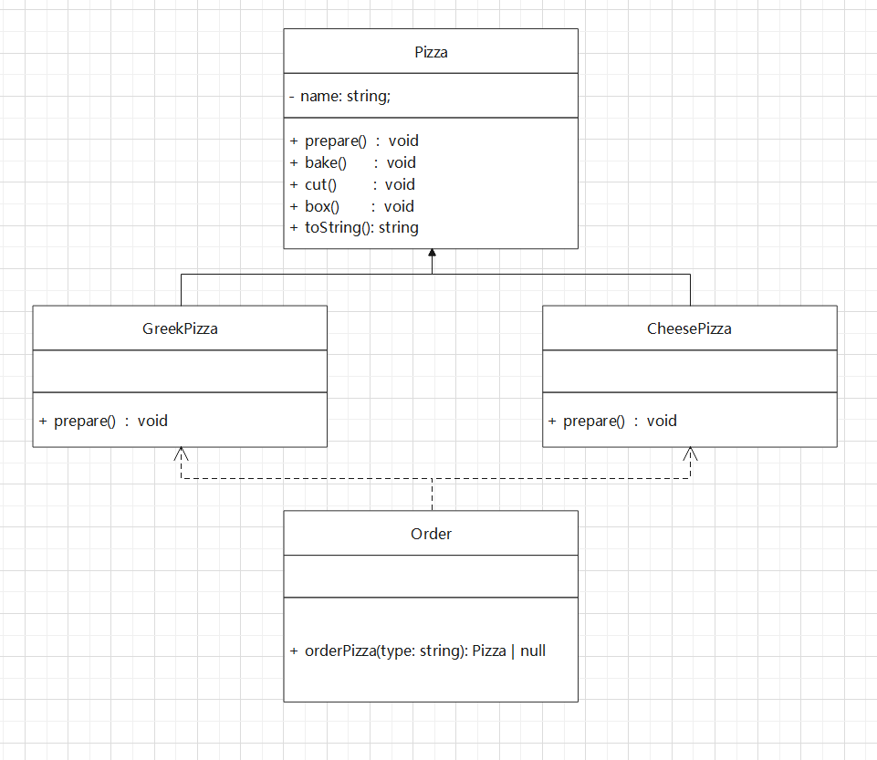
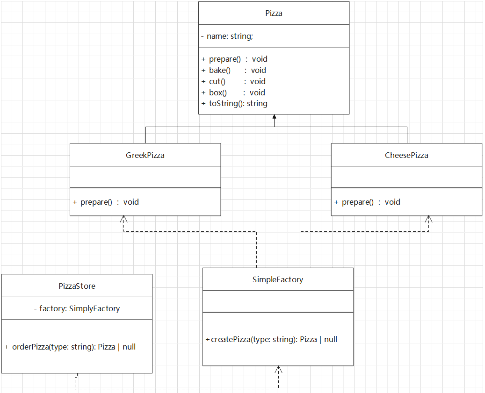
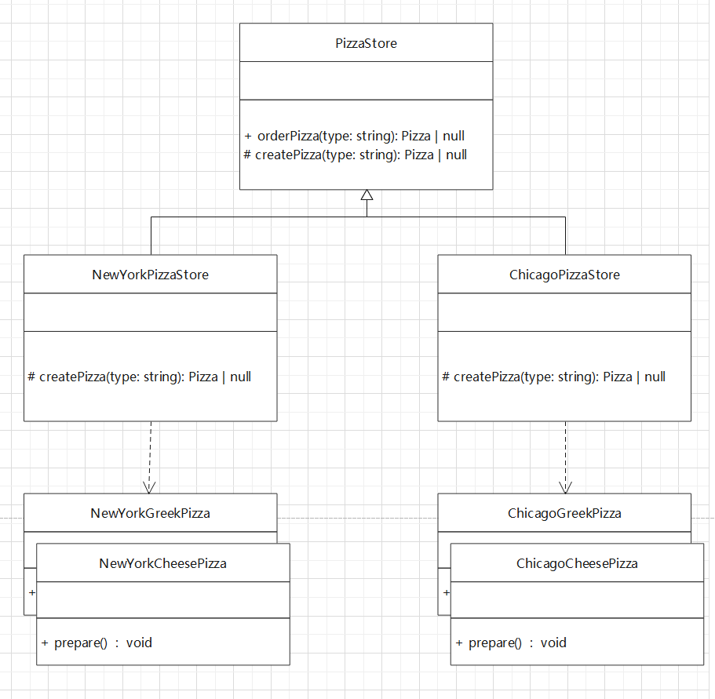
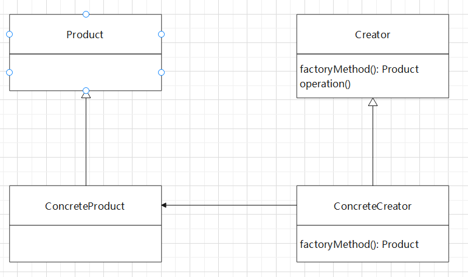
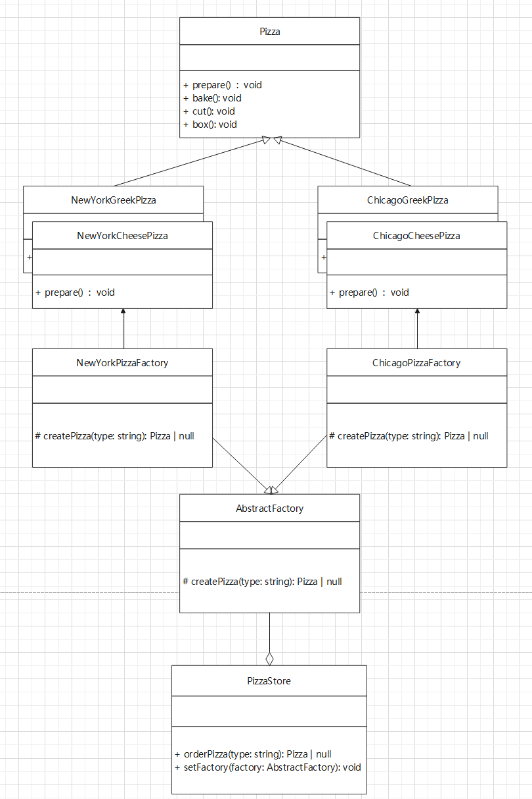

## introduction 

从一个简单的案例开启我们的工厂模式。

现在我们有一个需求：
我们新开了一个 Pizza 商店，为了便于 Pizza 种类的扩展和维护，我们需要自行设计其功能。

要求如下：
1. 披萨的种类很多。例如：GreekPizza，CheesePizza。
2. 披萨的制作要有 prepare, bake, cut, box 四个步骤。其中 prepare 的材料可能不同，其他的步骤基本一致。
3. 完成 Pizza 店的订购功能。

## 简单地实现



我们创建一个 `Pizza` 的抽象类，将 `prepare` 设置抽象方法，让具体的子类去重写该
方法即可。最后，我们再创建一个 `Order` 类，用于派发订单。

具体的代码实现如下：
```javascript
// common.ts
export abstract class Pizza {
  constructor(private name: string) {}

  public abstract prepare(): void;

  public bake(): void {
    console.log(`${this.name} pizza is baking...`);
  }
  
  public cut(): void {
    console.log(`${this.name} pizza is cutting...`);
  }
  
  public box() : void {
    console.log(`${this.name} pizza is boxing...`);
  }
  
  public toString() : string {
    return `${this.name}Pizza`;
  }
}

export class CheesePizza extends Pizza {
  constructor() {
    super('Cheese');
  }

  public prepare(): void {
    console.log('Cheese pizza is preparing...');
  }
}

export class GreekPizza extends Pizza {
  constructor() {
    super('Greek');
  }

  public prepare(): void {
    console.log('Greek pizza is preparing...');
  }
}

import { CheesePizza, GreekPizza, Pizza } from './common'

class PizzaStore {
  protected createPizza(type: string): Pizza | null {
    type = type.toLowerCase();
    let pizza: Pizza | null = null;
    switch (type) {
      case 'cheese':
        pizza = new CheesePizza();
        break;
      case 'greek':
        pizza = new GreekPizza();
        break;
    }
    return pizza;
  }

  public orderPizza(type: string): Pizza | null {
    const pizza = this.createPizza(type);
    if (!pizza) return null;
    pizza.prepare();
    pizza.bake();
    pizza.cut();
    pizza.box();
    return pizza;
  }
}

function main() {
  let type = 'cheese';
  let pizza = new PizzaStore().orderPizza(type);
  console.log(pizza)
}
```

上面的实现方法虽然简单，但是违反了 **OCP** 原则。
一旦我们添加了一种新的 `Pizza` 种类，我们还需要在 `PizzaStore` 中修改
我们的代码，如果我们的 PizzaStore 不止一个的话，我们需要修改的地方会很多，
代码维护起来不太方便。

## 简单工厂

改进思路：将创建 `Pizza` 对象封装到一个类中，同时对外暴露一个接口，
这也我们有新的 Pizza 种类时，
只需要修改该类即可，其他的代码不需要修改。



从上面的图我们可以看到，我们将创建 Pizza 的方法由一个 SimpleFactory 管理，
而我们的 PizzaStore 只需要管理自身 orderPizza 方法。这种实现方式便于后续
的管理，也就是说，当我们创建一个新的 Store 的话，我们可以复用 PizzaStore 
中的代码。

具体实现代码如下：
```typescript
import { CheesePizza, GreekPizza, Pizza } from "./common";

class SimpleFactory {
  createPizza(type: string): Pizza | null {
    let pizza: Pizza | null = null;
    type = type.toLowerCase();

    switch (type) {
      case 'cheese':
        pizza = new CheesePizza();
        break;
      case 'greek':
        pizza = new GreekPizza();
        break;
      default:
        break;
    }
    return pizza;
  }
}

class PizzaStore {
  constructor(private factory: SimpleFactory) {}
  
  public orderPizza(type: string): Pizza | null {
    const pizza = this.factory.createPizza(type);
    if (!pizza) return null;
    pizza.prepare();
    pizza.bake();
    pizza.cut();
    pizza.box();
    return pizza;
  }
}

function main() {
  new PizzaStore(new SimpleFactory()).orderPizza('cheese');
}

main();
```

> 简单工厂模式：定义了一个创建对象的类，由这个类来封装实例化对象的行为代码。

## 工厂方法

简单工厂之所以简单，是其功能还不够完备，如果我们的 PizzaStore 急速扩张，
针对不同的地区，我们有不同口味的 Pizza。显然，简单工厂在实现这个需求上有些
乏力。例如：我们现在有两间 PizzaStore，分别是 ChicagoPizzaStore 和 NewYorkPizzaStore，如果使用简单工厂实现的话，我们需要采用如下的方式：

```typescript
class SimpleFactory {
  createPizza(factoryName: string, type: string): Pizza | null {
    let pizza: Pizza | null = null;
    type = type.toLowerCase();
    factoryName = factoryName.toLowerCase();

    if (factoryName === 'newyork') {
      switch (type) {
        case 'cheese':
          pizza = new NewYorkCheesePizza();
          break;
        case 'greek':
          pizza = new NewYorkGreekPizza();
          break;
        default:
          break;
      }
    }
    return pizza;
  } else if (factoryName === 'chicago') {
    // ...
  }
}
```

显然，随着业务量的增长，if 分支语句会撑满整个 SimpleFactory。

下面我们就用工厂方法来实现这个需求。

> 工厂方法定义了一个用于创建对象的接口，让子类决定实例化那个类。即，一个类
> 的实例化推迟到其子类中。

下面是我们的抽象工厂的实现：
```typescript
abstract class PizzaStore {
  public orderPizza(type: string): Pizza | null {
    const pizza = this.createPizza(type);
    if (!pizza) return null;
    pizza.prepare();
    pizza.bake();
    pizza.cut();
    pizza.box();
    return pizza;
  }

  protected abstract createPizza(type: string): Pizza | null;
}
```

我们将 `createPizza` 设置为抽象方法，具体的实现推迟到对应的子类中。

```typescript
class NewYorkPizzaStore extends PizzaStore {
  protected createPizza(type: string): Pizza | null {
    let pizza: Pizza | null = null;
    type = type.toLowerCase();

    switch (type) {
      case 'cheese':
        pizza = new NewYorkCheesePizza();
        break;
      case 'greek':
        pizza = new NewYorkGreekPizza();
        break;
      default:
        break;
    }
    return pizza;
  }
}

class ChicagoPizzaStore extends PizzaStore {
  protected createPizza(type: string): Pizza | null {
    let pizza: Pizza | null = null;
    type = type.toLowerCase();

    switch (type) {
      case 'cheese':
        pizza = new ChicagoCheesePizza();
        break;
      case 'greek':
        pizza = new ChicagoGreekPizza();
        break;
      default:
        break;
    }
    return pizza;
  }
}
```



将工厂方法抽象后可以得到如下的实现方式：


## 抽象工厂
所谓抽象工厂，是定义了一个 interface 用于创建有相关依赖或依赖关系的对象簇，
而无需指明具体的类。

抽象工厂模式看成是将简单工厂和工厂方法进行整合。
从设计层面上看，抽象工厂是简单工厂做的改进。将工厂抽象成两部分：
AbstractFactory 和 ConcreteFactory，程序员可以根据创建对象类型使用对应的工厂子类，
这种将单个简单工厂类变成了工厂簇，便于后续代码的维护和管理。



AbstractFactory 定义出一系列的工厂簇，然后将具体的工厂聚合到 PizzaStore 中即可。

代码和上面工厂方法类似，这里只展示了 `PizzaStore` 的具体实现：
```typescript
class PizzaStore {
  private factory!: AbstractFactory;
  
  setFactory(factory: AbstractFactory) {
    this.factory = factory;
  }

  orderPizza(type: string) {
    const pizza = this.factory.createPizza(type);
    if (!pizza) return null;
    pizza.prepare();
    pizza.bake();
    pizza.cut();
    pizza.box();
    return pizza;
  }
}
```

实现的原理就是将 `createPizza` 交由一个工厂创建，而不是自己内部
去创建。

<!-- ## 应用 -->

