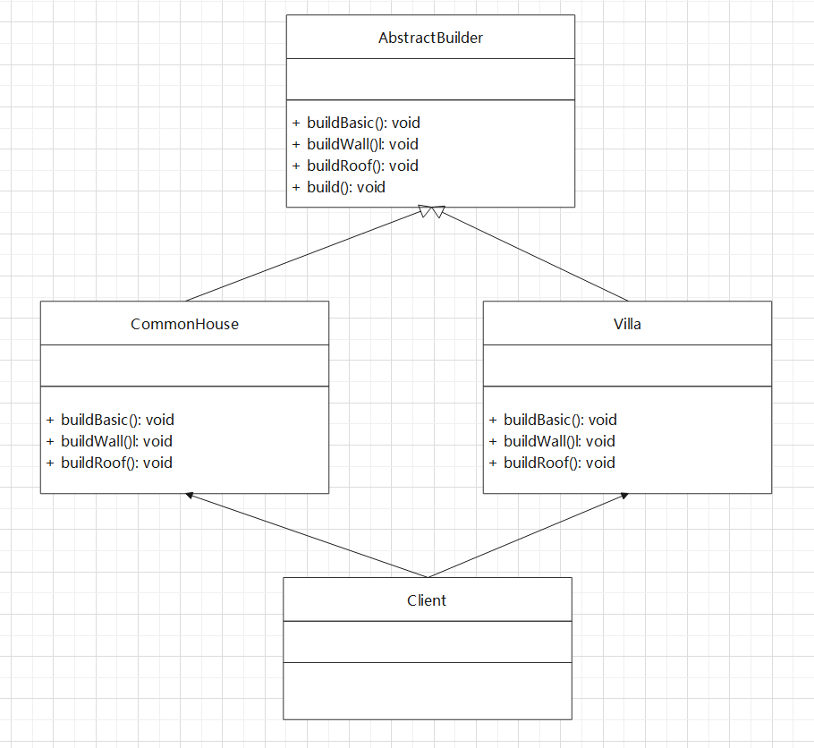
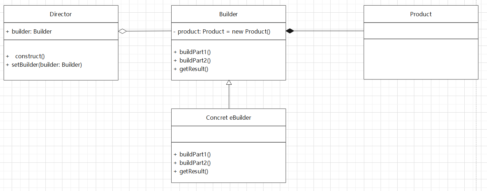
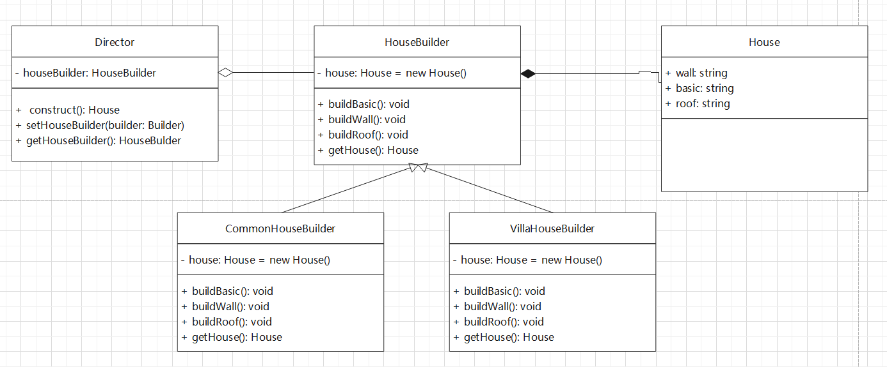

## introduction

引例：
现在我们需要建造一座房子。要求建造的过程有：大庄、砌墙、封顶。

所建的房子有多种，可以是普通房、高楼、别墅。各种房子的构造过程是相同的，但是
要求不相同。

下面我们采用传统的方式实现这个构造房子的过程：

```typescript
abstract class AbstractHouse {
  public abstract buildBasic(): void
  public abstract buildWall(): void
  public abstract buildRoof(): void
  public build(): void {
    this.buildBasic()
    this.buildWall()
    this.buildRoof()
    console.log('done')
  }
}

class CommonHouse extends AbstractHouse {
  public buildBasic(): void {
    console.log(`build basic of CommonHouse`)
  }
  public buildWall(): void {
    console.log(`build wall of CommonHouse`)
  }
  public buildRoof(): void {
    console.log(`build roof of CommonHouse`)
  }
}

class Villa extends AbstractHouse {
  public buildBasic(): void {
    console.log(`build basic of Villa`)
  }
  public buildWall(): void {
    console.log(`build wall of Villa`)
  }
  public buildRoof(): void {
    console.log(`build roof of Villa`)
  }
}

function main() {
  const house: AbstractHouse = new Villa()
  house.buildBasic()
  house.buildWall()
  house.buildRoof()
  house.build()
}

main()
```

为了更好地理解传统的实现方式，请看下面的类图：


使用传统的方式实现，其过程简单，容易操作。
但是，从程序的设计结构上看，传统的实现方式没有设计缓存层对象，程序的扩展性
和维护性差，也就是说，这种设计方案把产品和创建产品的过程封装在一起，耦合性
过高。

解决方案：将产品和产品的生产过程分离，实现解耦合。这就是我们要讲的建造者模式。

## 建造者模式

> 建造者模式又称生成器模式，是一种对象的构建模式，它可以讲复杂对象的建造
> 过程抽离出来，使这个抽象过程的不同实现方法可以构造出不同表现（属性）的
> 对象。
> 建造者模式是一步步创建一个复杂对象的过程，它允许用户只通过指定复杂对象
> 的类型和内容就可以构建它们，用户不需要知道内部的具体构建细节。



落实到当前项目，其 UML 图如下：



具体代码实现如下：

```typescript
class House {
  public basic: string | undefined
  public wall: string | undefined
  public roof: string | undefined
  toString() {
    return `basic: ${this.basic}, wall: ${this.wall}, roof: ${this.roof}`
  }
}

abstract class HouseBuilder {
  protected house: House = new House()
  public abstract buildBasic(): void
  public abstract buildWall(): void
  public abstract buildRoof(): void

  public getHouse(): House {
    return this.house
  }
}

class CommonHouseBuilder extends HouseBuilder {
  public buildBasic(): void {
    this.house.basic = 'common house basic'
    console.log('Building basic of common house')
  }
  public buildWall(): void {
    this.house.wall = 'common house wall'
    console.log('Building wall of common house')
  }
  public buildRoof(): void {
    this.house.roof = 'common house roof'
    console.log('Building roof of common house')
  }
}

class VillaHouseBuilder extends HouseBuilder {
  public buildBasic(): void {
    this.house.basic = 'villa house basic'
    console.log('Building basic of villa house')
  }
  public buildWall(): void {
    this.house.wall = 'villa house wall'
    console.log('Building wall of villa house')
  }
  public buildRoof(): void {
    this.house.roof = 'villa house roof'
    console.log('Building roof of villa house')
  }
}

class Director {
  private houseBuilder: HouseBuilder | null = null

  public setHouseBuilder(houseBuilder: HouseBuilder) {
    this.houseBuilder = houseBuilder
  }

  public getHouserBuilder(): HouseBuilder | null {
    return this.houseBuilder
  }

  public construct(): House {
    if (this.houseBuilder === null) throw new Error('HouseBuilder is missing')
    this.houseBuilder.buildBasic()
    this.houseBuilder.buildWall()
    this.houseBuilder.buildRoof()
    return this.houseBuilder.getHouse()
  }
}
```

使用过程如下，其核心是通过 Director 控制构建过程，实现解耦合：

```typescript
const director = new Director()
director.setHouseBuilder(new CommonHouseBuilder())
let house = director.construct()
console.log(`building common house: `, house.toString())

director.setHouseBuilder(new VillaHouseBuilder())
house = director.construct()
console.log(`building villa house: `, house.toString())
```

## 建造者模式与抽象工厂的区别
