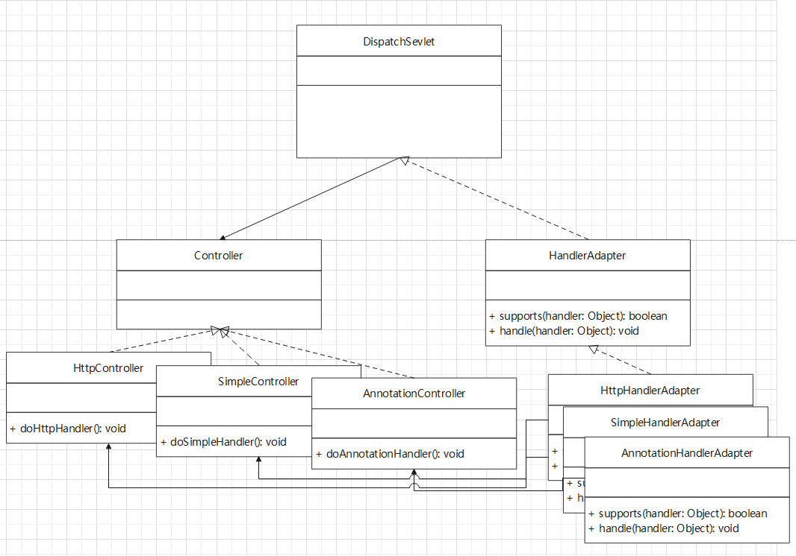

<!-- ## Introduction -->

## 工作原理

适配器可以作为一个中间套件，连接两个不同的外观但功能相似的物品。

像我们日常使用 usb 转接口就是一个适配器。例如 荣耀笔记本的转接口就是
将 usb 接口适配到 type-c 接口上。


还有一种适配器就是三插头转二插头的充电头：


适配器的原理和我们日常的转接口类似。

> 适配器模式(Adapter Pattern)指的是将某个类的接口转换成客户端期望的另一个
> 接口 表示，主要目的是兼容性，让原本因不匹配而不能工作的两个类可以协同工作。

适配器模式主要分为三类：

1. 类适配器
2. 对象适配器
3. 接口适配器

## 类适配器

类适配器的基本原理是通过继承实现的。
让 `Adapter` 类通过继承 `src` 类，然后实现 `dest` 接口，
从而实现 `src` 到 `dest` 的适配。

以生活中的实际例子来解释类适配器：
我们平时用的电压是 220V 的交流电压，但是，手机充电
并不能支持如此高的电压，假设我们手机充电输入电压为 5V，
那么我们想要给我们的手机充电，就需要借助适配器了，这里
我们使用类适配器作为案例讲解：

这里的 `src` 就是我们的输入电压 220V（我们记为 Voltage220），
`dest` 就是我们要给我们手机充电的电压（我们记为 Voltage5），
而我们的适配器就是要完成 Voltage220 到 Voltage5 的适配。


```typescript
interface IVoltage5 {
  output5(): number
}

class Voltage220 {
  public output220(): number {
    console.log('输出 220V')
    return 220
  }
}

class Adapter extends Voltage220 implements IVoltage5 {
  output5() {
    const output220 = super.output220()
    console.log('输出 5V')
    return output220 / 44
  }
}

class Phone {
  charging(adapter: Adapter): void {
    const voltage = adapter.output5()
    if (voltage > 5 || voltage <= 0) {
      throw new Error('invalid voltage')
    }
    console.log('给手机充电...')
    console.log(`当前输入电压为：${voltage}V`)
  }
}

function main() {
  const adapter = new Adapter()
  const phone = new Phone()
  phone.charging(adapter)
}
```

## 对象设配器

对象适配器与类适配器原理相同，只是将继承该成聚合实现适配。
来看具体的 UML 图：


从图中可以看到，我们的 `Adapter` 不再实现 `Voltage220` 而是改用了
聚合的方式，所以 `Client` 在使用的时候需要手动创建一个 `Voltage220`，
这样做的好处在于降低了代码的耦合性。

具体实现如下：

```typescript
interface IVoltage5 {
  output5(): number
}

class Voltage220 {
  public output220(): number {
    console.log('输出 220V')
    return 220
  }
}

class Adapter implements IVoltage5 {
  private voltage!: Voltage220

  public setVoltage(voltage: Voltage220) {
    this.voltage = voltage
  }

  output5() {
    if (!this.voltage) {
      throw new Error('input error: without voltage')
    }
    const output220 = this.voltage.output220()
    console.log('输出 5V')
    return output220 / 44
  }
}

class Phone {
  charging(adapter: Adapter): void {
    const voltage = adapter.output5()
    if (voltage > 5 || voltage <= 0) {
      throw new Error('invalid voltage')
    }
    console.log('给手机充电...')
    console.log(`当前输入电压为：${voltage}V`)
  }
}

function main() {
  const adapter = new Adapter()
  adapter.setVoltage(new Voltage220())
  const phone = new Phone()
  phone.charging(adapter)
}
```

## 接口适配器

接口适配器模式也称缺省适配器模式（default adapter pattern）。主要用于当接口不需要全部实现（可能接口在一开始
的设计上就存在问题），可以先设计一个 **抽象**类实现接口，并为该接口中每一个方法提供一个默认的实现（空方法），
然后该抽象类的子类可以选择性地覆盖父类的某些方法实现需求。

来看下面的代码：

```typescript
interface IInterface {
  method1(): void
  method2(): void
  method3(): void
}

abstract class AClass implements IInterface {
  method1(): void {}
  method2(): void {}
  method3(): void {}
}

function useInterface(i: IInterface): void {
  i.method1()
}

function main() {
  const aClass = new (class extends AClass {
    method1() {
      console.log('这是一个匿名类...')
    }
  })()

  useInterface(aClass)
}

main()
```

我们的程序需要依赖到 `IInterface` 接口，但是不需要使用到该接口中的所有
方法。所以，我们可以创建一个抽象类，该抽象类为此接口提供默认的实现方式。
其子类就可以正常地使用该接口了，也就完成我们程序的需求。

## 应用实战

SpringMVC 中也使用到该设计模式，其 UML t 图如下：



核心方法是 `DispatchServlet` 中的 `doDispatch`，大致的运作流程为：

1. 根据输入的 `request` 获取 相应的 `Controller`。
2. 根据 `Controller` 获取支持该 `Controller` 的适配器。
3. 调用适配器的 `handle` 方法（适配器又调用了 `Controller` 中不同的 `handle` 方法）。

<!-- ## 小结 -->
