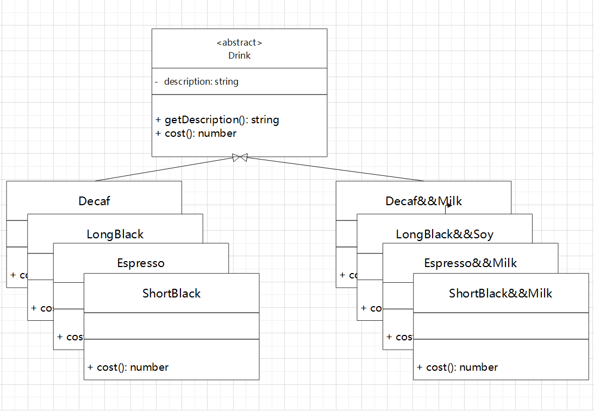
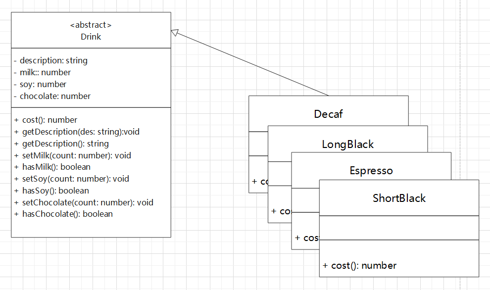
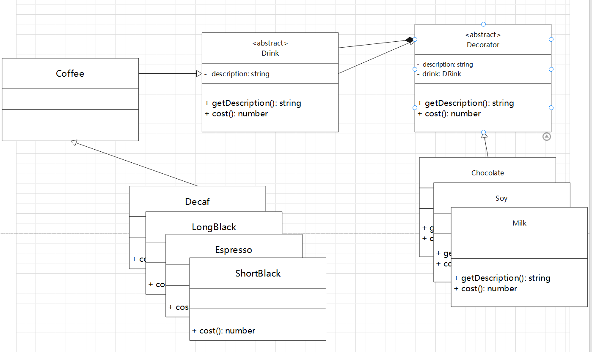

## 引例

星巴克咖啡订单项目：
1. 单品咖啡。
   - Espresso
   - ShortBlack
   - LongBlack
   - Decaf

2. 调料。
   - Milk
   - Soy
   - Chocolate

3. 要求。
   - 在扩展**新的咖啡种类**时，具有良好的拓展性、方便改动、方便维护。
   - 使用 OO 计算不同种类咖啡的费用：用户可以单点单品咖啡，也可以点单品咖啡 + 调料。

### 实现方案1

采用笛卡尔组合的方式。



这种实现方式简单粗暴，但是很繁琐，一旦有新的产品出现的话（例如：多了一种新的调味品
Sugar），我们还需要根据它的排列组合创建新的类，很容易就出现类爆炸。

### 实现方案2

从方案1我们可以知道采用 **单品咖啡+调料** 组合的方式会导致类爆炸，那么
我们可以采用将调料内置到 **单品咖啡(Drink)** 中，这样就不会导致类爆炸
出现，从而提高代码的维护性。



我们将调味料以属性的方式聚合到 `Drink`，使用 `setter` 来设置调料的分数，
如果没用添加某种调料则默认为 0，在计算价格的时候，我们可以根据调味料的
数量进行计算。

虽然方案 2 解决了类爆炸的问题，但它有引申出新的问题：违反了我们的 OCP 原则，
也就是我们无法对于修改封闭。例如：我们添加一种新的调料的话，我们还需要在
`Drink` 中内聚一个新的属性，同时添加 `setter` 和 `has` 方法。显然，这种
实现方式是行不通的，那么，是否还有其他方案来实现我们的需求？

### 方案3：装饰者模式

从上面的实现方案来看，调味料作为属性聚合到 `Drink` 内部，那么我们能否不将调料直接
聚合到内部，而是在使用到调料时，我们重新计算 `Drink` 的价格和和修改描述？
也就是说我们把调料作为一种修饰品用来修饰我们的 `Drink`，所以与其将调料聚合到 `Drink` 内部，
倒不如我们将 `Drink` 聚合到调料内部，每次添加一种调料的时候，我们调用调料的 `cost` 方法
重新计算价格。

从结果上看，我们的调料也继承了 `Drink` 相同的接口，使其表现出与 `Drink` 相同的行为，具体如下图所示：



我们额外创建了一个 `Coffee` 只是用于作为缓冲层方便后续的扩展。

具体的实现代码如下：
```typescript
// 为了方便计算，我们把咖啡和调料的价格直接写死了
const MILK_PRICE = 5;
const SOY_PRICE = 10;
const CHOCOLATE_PRICE = 8;
const ESPRESSO_PRICE = 100;
const LONGBLACK_PRICE = 120;
const SHORTBLACK_PRICE = 125;
const DECAF_PRICE = 130;

interface IDrink {
  cost(): number;
  getDescription(): string;
}

abstract class Decorator implements IDrink {
  protected drink!: IDrink;

  constructor(drink: IDrink) {
    this.drink = drink;
  }

  public cost(): number {
    return this.drink.cost();
  }
  public getDescription(): string {
    return this.drink.getDescription();
  }
}

abstract class Drink implements IDrink {
  protected description: string = '';
  
  constructor() {
  }

  public abstract cost(): number;
  public getDescription(): string {
    return this.description;
  }
}

abstract class Coffee extends Drink {}

class Decaf extends Coffee {
  constructor() {
    super();
    this.description += 'Decaf'
  }
  public cost(): number {
    return DECAF_PRICE;
  }
}

class LongBlack extends Coffee {
  constructor() {
    super();
    this.description += 'LongBlack';
  }

  public cost(): number {
    return LONGBLACK_PRICE;
  }
}

class Espresso extends Coffee {
  constructor() {
    super();
    this.description += 'Espresso'
  }
  public cost(): number {
    return ESPRESSO_PRICE;
  }
}

class ShortBlack extends Coffee {
  constructor() {
    super();
    this.description += 'ShortBlack'
  }

  public cost(): number {
    return SHORTBLACK_PRICE;
  }
}

class Milk extends Decorator {
  public cost(): number {
    return super.cost() + MILK_PRICE;
  }

  public getDescription(): string {
    return this.drink.getDescription() + ' + milk';
  }
}

class Soy extends Decorator {
  public cost(): number {
    return super.cost() + SOY_PRICE;
  }
  public getDescription(): string {
    return super.getDescription() + ' + soy';
  }
}
class Chocolate extends Decorator {
  public cost(): number {
    return super.cost() + CHOCOLATE_PRICE;
  }
  public getDescription(): string {
    return super.getDescription() + ' + chocolate';
  }
}
```

来看一下测试的代码：
```typescript
function main() {
  let coffee: Coffee = new LongBlack();
  let drink: IDrink = new Milk(coffee);
  let cost = drink.cost();
  let desc = drink.getDescription();
  console.log('cost = ', cost, ', desc = ', desc);
  console.log('---------------------------')
  drink = new Soy(drink)
  cost = drink.cost();
  desc = drink.getDescription();
  console.log('cost = ', cost, ', desc = ', desc);
}

main();
/*
cost =  125 , desc =  LongBlack + milk
cost =  135 , desc =  LongBlack + milk + soy
*/
```

这种实现方式方便我们后续的扩展。例如：我们可以添加 Sugar 这种新的调料，那么我们只需要
为 Sugar 创建一个 `Decorator` 类，然后装饰到我们想要添加的饮料上即可。

```typescript
function main() {
  let coffee: IDrink = new ShortBlack();
  coffee = new Sugar(coffee);
  console.log('cost = ', coffee.cost(), ', desc = ', coffee.getDescription());
  coffee = new Milk(coffee);
  console.log('cost = ', coffee.cost(), ', desc = ', coffee.getDescription());
}

main();
/*
cost =  127 , desc =  ShortBlack + sugar
cost =  132 , desc =  ShortBlack + sugar + milk
*/
```

### 小结

通过使用装饰者模式我们的程序的扩展性变得更好，从代码上看，装饰者模式是在
原有类的基础上**添加责任**，不会修改原有类的实现。
