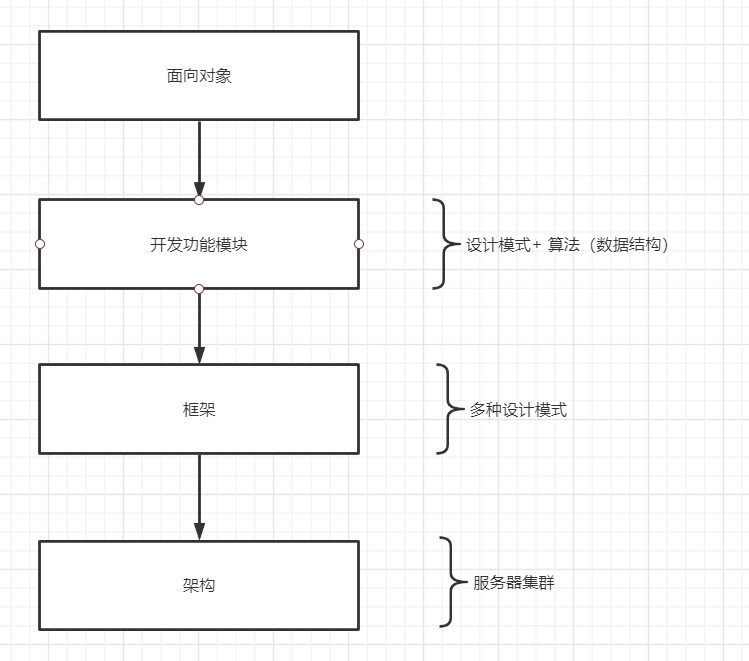

基于《Head First 设计模式》的学习笔记和心得。与书本不同的是，本系列是通过 typescript / java 实现书中的设计模式，具体使用哪一个
视情况而定。

学习设计模式的目的是为了从更高的层面理解软件开发。
通过学习设计模式，提供自身的编码能力，同时提供代码的简洁性。

## content

- [ 设计原则 ](0-principles.md)
- [ 策略模式 ](./1-strategy.md)
- [ 观察者模式 ](./2-observer.md)
- [ 工厂模式 ](./3-factory.md)

## 设计模式要解决的问题

设计模式要解决的问题是通过：

1. 减低代码的耦合性。
2. 提高代码的复用性。
3. 改善代码的可读性。
4. 完善代码的规范性。
5. 提供代码的可拓展性。

从而实现程序内**高内聚，低耦合**。

## 设计模式的应用场景

## 设计模式博客写作风格

1. Introduction。从一个实际需求出发，引入设计模式。
2. Implementation。
   - Tradition。使用传统的方式实现需要。
   - Design pattern。使用特定的设计模式实现需求。
   - Comparison。比较传统的实现方式和通过设计模式实现，
     从而引出设计模式的优缺点。
3. Principle analysis。原理刨析。
4. Application。介绍设计模式应用。