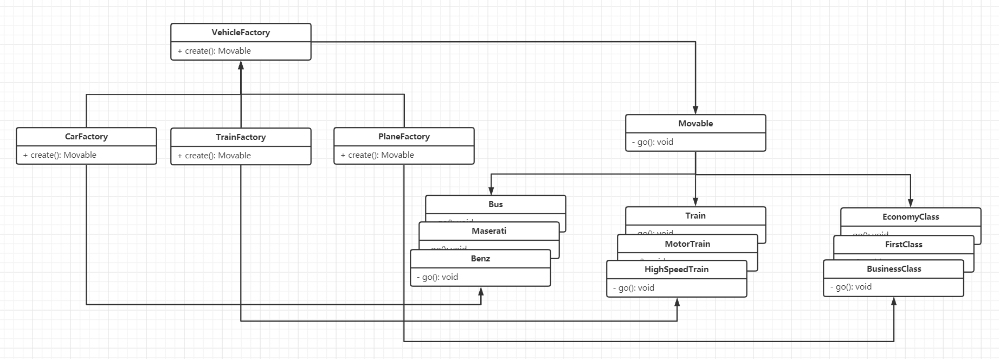
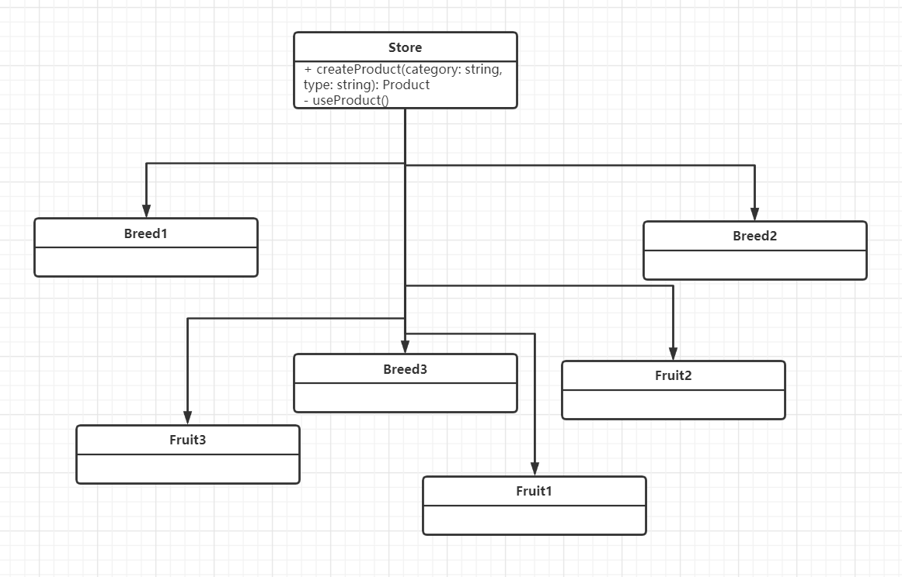
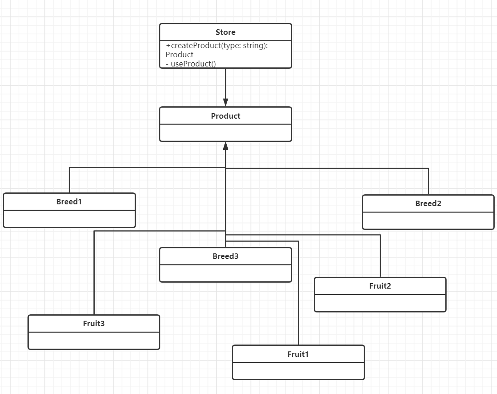
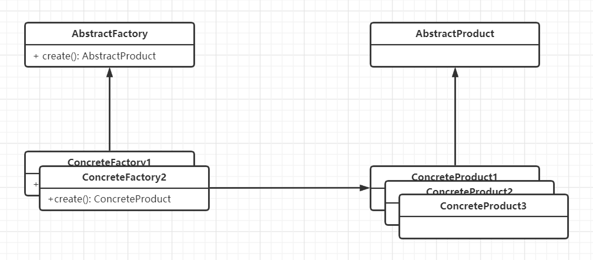

<center></center>

## 引例


```typescript
interface Movable {
  go(): void
}

class Car implements Movable {
  go(): void {
    console.log('car is moving...')
  }
}

class Plane implements Movable {
  go(): void {
    console.log('plane is moving...')
  }
}

class Train implements Movable {
  go(): void {
    console.log('train is moving...')
  }
}

enum MovableType {
  car,
  plane,
  train
}

function main(type: MovableType) {
  let m: Movable
  switch (type) {
    case MovableType.car:
      m = new Car()
      break
    case MovableType.plane:
      m = new Plane()
      break
    case MovableType.train:
      m = new Train()
      break
    default:
      throw new TypeError(`${type} is not movable...`)
  }
  m.go()
}

main(MovableType.car)
```

我们采用不同的交通工具前往目的地。对于不同的交通工具都实现了 `Movable` 接口。
上面的引例的确能实现这个基本功能，但是存在一个很严重的问题：上面的实现代码
不对修改做封闭。

什么叫做不对修改做封闭？举一个例子，现在我们又有了一个新的选择 -- 乘坐高铁，同时，
我们决定以后旅行不采用火车，那么我们改如果修改我们的代码呢？请看下面的实现：

```typescript
// ⬇⬇⬇⬇⬇⬇⬇⬇⬇⬇⬇⬇⬇⬇⬇⬇⬇⬇⬇
class HighSpeedTrain implements Movable {
  go(): void {
    console.log('high speed train is moving...')
  }
}

enum MovableType {
  car,
  plane,
  // ⬇⬇⬇⬇⬇⬇⬇⬇⬇⬇⬇⬇⬇⬇⬇⬇⬇⬇⬇
  // train,
  highSpeedTrain
}

function main(type: MovableType) {
  let m: Movable
  switch (type) {
    case MovableType.car:
      m = new Car()
      break
    case MovableType.plane:
      m = new Plane()
      break
    // ⬇⬇⬇⬇⬇⬇⬇⬇⬇⬇⬇⬇⬇⬇⬇⬇⬇⬇⬇
    // case MovableType.train:
    //   m = new Train();
    //   break;
    case MovableType.highSpeedTrain:
      m = new HighSpeedTrain()
      break
    default:
      throw new TypeError(`${type} is not movable...`)
  }
  m.go()
}
```

显然，这种实现方式不利于后期的维护，那么有什么办法来解决这个问题？
这就可以用到我们今天要讲的**工厂模式**。从上面的代码中我们也可以看到，
实际最需要修改的代码就是创建 Vehicles (Car, Plane, ...) 的过程，我们
将其称之为会变化的部分，所以我们接下来的部分就是对会变化的部分进行封装，
从而实现对修改封闭。

## 何为工厂

何为工厂呢？

简单地说，任何可以产生对象的**方法或类**，都可以称做工厂。
单例也算是一种工厂。

那么，为什么需要工厂呢？有 `new` 创建类还不够？
从上面的引例我们可以知道，简单地使用 `new` 去创建类显然有它
的局限性。使用工厂模式就是为了解决这种局限性，其次就是工厂模式
还可以在创建类的时候，对待创建的类进行修饰。

了解到工厂模式有这么多好处后，让我们深入浅出工厂模式吧。

首先，工厂可以分为一下几种：

1. 简单工厂。
2. 静态工厂。
3. 工厂方法。

### 简单工厂

事实上，简单工厂并不属于工厂模式的一种，它是一种编程习惯。
了解简单工厂对我们后续学习工厂模式也是很有帮助的，下面让我们
开一间简单工厂吧。

```typescript
class VehicleFactory {
  create(type: MovableType): Movable {
    console.log(`${MovableType[type]} is producing...`)
    let m: Movable
    switch (type) {
      case MovableType.car:
        m = new Car()
        break
      case MovableType.plane:
        m = new Plane()
        break
      // case MovableType.train:
      //   m = new Train();
      //   break;
      case MovableType.highSpeedTrain:
        m = new HighSpeedTrain()
        break
      default:
        throw new TypeError(`${MovableType[type]} is not movable...`)
    }
    console.log(`${MovableType[type]} is coming...`)
    return m
  }
}

function main() {
  const vehicleFactory = new VehicleFactory()
  const vehicle = vehicleFactory.create(MovableType.car)
  vehicle.go()
}

main()
```

我们将前面的引例使用简单工厂实现。从上面的代码我们可以看到
简单工厂与一开始实现的区别在于我们将创建类的过程使用一个工厂
实现。而且我们也可以看到很明显的好处在于，我们在创建类的过程
我们还可以对这个过程进行修饰，从而实现诸如权限、日志等功能。

但是，这种方案也是有不足之处。如果我们想实现定制化交通工具，
显然使用简单工厂是无法实现的。例如：我们要根据自身的经济状态
选择合适的出行工具，参考下面表格：

| condition |   car    |     plane     |     train      |
| :-------: | :------: | :-----------: | :------------: |
|   tight   |   Bus    | EconomyFlight |     Train      |
|   rich    |   Benz   |  FirstClass   |   MotorTrain   |
| well-off  | Maserati | BusinessClass | HighSpeedTrain |

要满足上面的要求，我们就需要借助抽象工厂了。

### 抽象工厂

抽象工厂就是将类创建的过程进一步抽象。考虑下面的代码：

```typescript
// ./typings.ts
export interface Movable {
  go(): void
}

export enum Status {
  tight,
  rich,
  wellOff
}

// ./index.ts
function main() {
  const currentStatus = Status.wellOff

  // 选择汽车作为出行工具。
  const factory: VehicleFactory = new CarFactory(currentStatus)
  const m: Movable = factory.create()
  m.go()
}

main()
```

我们选择汽车作为我们的出行工具。根据当前的经济状态，
工厂为我们选择相应的出行工具类型。`VehicleFactory` 规定
了出行工具的创建过程：

```typescript
// ./VehicleFactory.ts
import { Movable, Status } from './typings'

export default abstract class VehicleFactory {
  protected _status: Status

  constructor(status: Status) {
    this._status = status
  }

  get status(): string {
    return Status[this._status]
  }

  abstract create(): Movable
}
```

在抽象工厂中，我们提供 `create` 的抽象方法，其他
子类需要在此基础上实现**定制化**的创建对象方法。
从而实现根据不同的经济状态，选择不同的出行工具。


让我们来看其中一种交通工具(Car)的具体实现：

```typescript
// ./car/CarFactory.ts
import { Movable, Status } from '../typings'
import VehicleFactory from '../VehicleFactory'
import Benz from './Benz'
import Bus from './Bus'
import Maserati from './Maserati'

export default class CarFactory extends VehicleFactory {
  create(): Movable {
    let m: Movable
    switch (this._status) {
      case Status.tight:
        m = new Bus()
        break
      case Status.rich:
        m = new Benz()
        break
      case Status.wellOff:
        m = new Maserati()
        break
      default:
        throw new TypeError(`unknown economic status: ${this._status}`)
    }
    return m
  }
}

// ./car/Bus.ts
import { Movable } from '../typings'

export default class Bus implements Movable {
  go(): void {
    console.log('bus is moving...')
  }
}

// ./car/Benz.ts
import { Movable } from '../typings'

export default class Benz implements Movable {
  go(): void {
    console.log('benz is moving...')
  }
}

// ./car/Maserati.ts
import { Movable } from '../typings'

export default class Maserati implements Movable {
  go(): void {
    console.log('Maserati is moving...')
  }
}
```

其中，最重要莫过于 `CarFactory`，它继承至 `VehicleFactory` 并
实现了定制化的创建类过程。

其他工厂也型类似。

从上面的示例可以看到，工厂模式让我们代码实现对修改封闭的
同时还提供了定制化的功能。此外，如果我们还可以动态地绑定
创建的工厂，例如：

```typescript
// ./typings.ts
// ⬇⬇⬇⬇⬇⬇⬇⬇⬇⬇⬇⬇⬇⬇⬇⬇⬇⬇⬇⬇⬇⬇⬇⬇⬇⬇
export enum VehicleType {
  car,
  plane,
  train
}

// ./index.ts
import CarFactory from './car/CarFactory'
import PlaneFactory from './plane/PlaneFactory'
import TrainFactory from './train/TrainFactory'
import { Movable, Status, VehicleType } from './typings'
import VehicleFactory from './VehicleFactory'

function getVehicle(vehicleType: VehicleType, status: Status): Movable {
  let vehicleFactory: VehicleFactory
  switch (vehicleType) {
    case VehicleType.car:
      vehicleFactory = new CarFactory(status)
      break
    case VehicleType.plane:
      vehicleFactory = new PlaneFactory(status)
      break
    case VehicleType.train:
      vehicleFactory = new TrainFactory(status)
      break
    default:
      throw new TypeError(`${vehicleType} not exists...`)
  }
  return vehicleFactory.create()
}

function main() {
  const currentStatus = Status.wellOff
  const choice = VehicleType.plane
  const m = getVehicle(choice, currentStatus)
  m.go()
}

main()
```

通过以上我示例，我们可以见识到工厂模式的威力。
事实上，我们还可以在创建对象的时候实现其他功能
例如：日志、权限等。这种编程方式也被称为面向
切面编程（AOP），这里就不再赘述了。

### 依赖倒置

好的设计要求代码对具体类的依赖要尽可能的小，**要依赖抽象，而不是具体的类**。
也就是说高级组件不直接依赖低级组件。

下面我们从案例出发来阐述这个原则。

先来看一个**很依赖**的例子：

```typescript
class Store {
  createProduct(category: string, type: string): Product | null {
    let product: Product;
    if (category === 'breed') {
      if (type === '1') { product = new Breed1(); }
      else if (type === '2') { product = new Breed2(); }
      else if (type === '3') { product = new Breed3(); }
      else { return null; }
    } else if (category === 'fruit') {
      if (type === '1') { product = new Fruit1(); }
      else if (type === '2') { product = new Fruit2(); }
      else if (type === '3') { product = new Fruit3(); }
      else { return null; }
    } else {
      return null;
    }
    return product;
  }

  useProduct(category: string, type: string) {
    const product = this.createProduct(category, type);
    console.log(`using ${product}...`);
  }
}

abstract class Product {}
class Breed1 extends Product {}
class Breed2 extends Product {}
class Breed3 extends Product {}

class Fruit1 extends Product {}
class Fruit2 extends Product {}
class Fruit3
```

上面的例子中，顶层 (`Store`) 组件太多依赖底层组件 (`ProductN`)。
这会导致我们后续修改代码会很麻烦。下面我们就用工厂模式对其进行改造
实现**依赖倒置**的原则。



```typescript
abstract class Store {
  abstract createProduct(type: string): Product | null

  useProduct(category: string) {
    const product = this.createProduct(category)
    console.log(`using ${product}...`)
  }
}

class BreedStore extends Store {
  createProduct(type: string): Product | null {
    let product: Product
    if (type === '1') {
      product = new Breed1()
    } else if (type === '2') {
      product = new Breed2()
    } else if (type === '3') {
      product = new Breed3()
    } else {
      return null
    }
    return product
  }
}

class FruitStore extends Store {
  createProduct(type: string): Product | null {
    let product: Product
    if (type === '1') {
      product = new Fruit1()
    } else if (type === '2') {
      product = new Fruit2()
    } else if (type === '3') {
      product = new Fruit3()
    } else {
      return null
    }
    return product
  }
}
```

我们只需要对上述的 `Store` 进行改造，使其变成一个抽象的工厂，
然后具体的生产产品 (`createProduct`) 由具体的 `Store` 去创建。
实现后的效果如下图所示：上层组件只依赖一个抽象的接口，
下层组件依赖上层组件提供的接口，从而实现依赖倒置。



### 静态工厂

### 小结

下面我们用一张图来简单总结我们的工厂模式：


